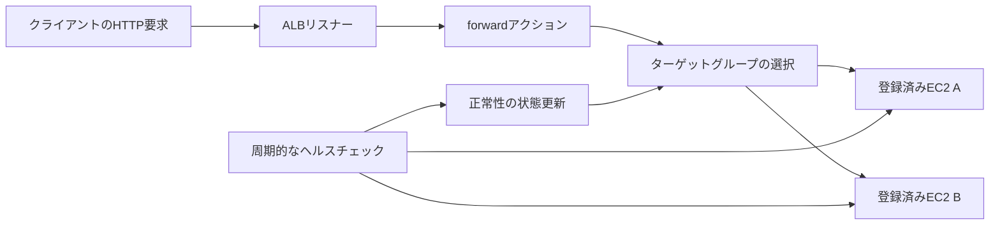

# ALB：振り分けとヘルスチェックの条件

対象：既存単位 `alb`。HTTP/HTTPSのステートレスなサービス、EC2インスタンスのターゲット、通常のリージョンAZを扱う。Outposts、Local Zones、Lambdaターゲット、重み付き複数ターゲットグループはケースの対象外。

## 用語と要素

ALBはApplication Load Balancerの略。リスナーは待ち受けるポートとプロトコル、ルールのアクションを持つ。ターゲットグループは登録した処理先とヘルスチェック設定をまとめる。ここではリスナーのデフォルトルールを、単一ターゲットグループへのforwardに設定する。EC2はアプリを実行する処理先。

ALBを置くだけでEC2が登録されたり、アプリが起動したり、セキュリティグループの許可が整ったりするわけではない。通常のリージョンAZのALB作成には2つ以上のAZのサブネットを指定する。OutpostsやLocal Zonesには別条件があるため「すべてのALBが必ず2AZ」と一般化しない。

## 仕組み・入力と出力

入力はクライアント要求とヘルスチェックの結果。通常の振り分けでは正常な処理先を選び、選んだアプリの応答をクライアントへ返す。ヘルスチェックは別の周期的な確認であり、すべての業務要求の成功を予測するものではない。タイムアウト、許容する応答コード、パス、ポート、連続成功・失敗のしきい値を設定する。失敗を一度検出した瞬間に必ず全要求を別のEC2へ移すとは説明しない。

## 依存条件と異常時の動き

- リスナーの転送先、ターゲット登録、アプリの待ち受け、業務通信とヘルスチェックの到達性を確認する。健康状態は指定した確認先についての判定であり、全業務機能が成功する保証ではない。
- インスタンス型のターゲットではヘルスチェックは常時有効で、無効化できない。連続失敗が `UnhealthyThresholdCount` に達すると異常と判定する。周期・タイムアウトがあるため検出には時間がかかる。
- `target_group_health.unhealthy_state_routing.minimum_healthy_targets.count` は正常数の下限。これを下回ると異常先も含む全ターゲットへ送る。既定は1、割合しきい値の既定はoff。この前提で正常数0なら異常先にも送る。これはフェイルオープンと呼ばれる挙動で、停止したアプリの修復や要求成功を保証しない。
- DNSフェイルオーバーのしきい値はゾーンをDNS上で異常扱いする別の設定。異常先へのルーティングと同じ操作ではない。クロスゾーン設定と評価対象を確認する。このケースは全AZの全ターゲットが異常という条件を明示し、評価範囲の違いを正解の曖昧さにしない。

## 比較・条件

| 状況 | 判断 | 限界 |
|---|---|---|
| 正常先が残り、異常時ルーティングのしきい値以上 | 通常の正常先への振り分けを考える | 残存容量や進行中要求の成功は別に確認する |
| 全ターゲットが異常、正常数下限1・割合off | 異常先も含めたルーティングが起こる | 全要求拒否や自動修復を期待しない |
| 正常数下限を3へ変更し正常数2 | 全異常より前でも下限を下回る | 「正常0のときだけ」という暗記では足りない |
| 転送先・到達性が未設定 | 役の3要素の名称だけでは動作しない | 実構成の条件を満たす必要がある |

複数AZ・複数EC2は障害範囲を分ける構成の素材。アプリ状態の扱い、残存容量、再試行、データ層まで含むAZ障害対策の設計と実験は、可用性単位の確認を経て別に進める。ここで無停止を保証しない。

## ケースと誤答理由

正本：`game-cases.json` の `alb-health-routing`。第1問は連続失敗しきい値による判定、第2問は全異常時のルーティング。各問で前提を再掲し、第1問の正答を第2問の前提にしない。全選択肢の理由と、正常数下限を変えた転移問いを正本に保持する。

## ゲームへの対応

既存の「負荷分散構成」はbalance・parallel・probeの3種類で成立する。この3枚は分散・複数処理先・状態確認の学習用の対応であり、リスナーやネットワーク等を省略した実AWSの必要十分条件ではない。追加攻撃3は架空の報酬。ヘルスチェックがあれば異常先へ絶対に送らないという誤学習を、役とカード詳細の補足で防ぐ。

## 出典と確認

無料公開のAWS公式SDK、コミット `2ba0e39015ddf9c91c6c378f8a4fb79dcb4353da` に固定。2026-10-06、Codexが本文・問題作成後にAPIコメントの該当条件と誤答を別工程で照合。同一担当の確認であり、別担当者の独立監査、AWSへの構築・負荷試験、本人理解評価は未実施。

- [CreateListener](https://github.com/aws/aws-sdk-go-v2/blob/2ba0e39015ddf9c91c6c378f8a4fb79dcb4353da/service/elasticloadbalancingv2/api_op_CreateListener.go)：デフォルトアクションと待ち受け設定。
- [CreateTargetGroup](https://github.com/aws/aws-sdk-go-v2/blob/2ba0e39015ddf9c91c6c378f8a4fb79dcb4353da/service/elasticloadbalancingv2/api_op_CreateTargetGroup.go)：パス、ポート、周期、連続成功・失敗とインスタンスの常時ヘルスチェック。
- [types](https://github.com/aws/aws-sdk-go-v2/blob/2ba0e39015ddf9c91c6c378f8a4fb79dcb4353da/service/elasticloadbalancingv2/types/types.go)：ActionのforwardとTargetGroupAttributeの異常時ルーティング・DNSしきい値。
- [CreateLoadBalancer](https://github.com/aws/aws-sdk-go-v2/blob/2ba0e39015ddf9c91c6c378f8a4fb79dcb4353da/service/elasticloadbalancingv2/api_op_CreateLoadBalancer.go)：通常AZとOutposts・Local Zonesのサブネット条件。

AWSドキュメントサイトは現在の取得制約で未確認。現行公式SDKで確認できた範囲に限定し、上記外の詳細は保留する。本文作成・内容確認・ローカル取り込み・Pages公開を別管理する。
