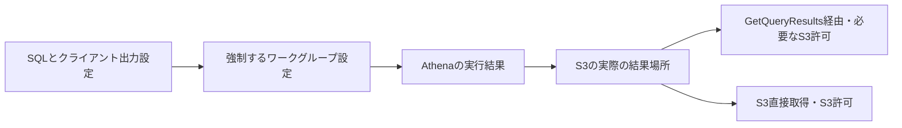

# Athenaの結果出力と取得経路の制御

## 学習目標・適用条件

S3へSQL結果を保存する構成で、出力設定が決まる順序と、結果を取得する経路を追う。Athenaのマネージド結果保存やSparkは対象外。結果再利用は別単位で扱う。

## 構成要素

- クライアント：SQLと結果設定を要求する。
- ワークグループ：出力先・暗号化等の設定をまとめ、クライアント側設定を上書きするかを決める。
- Athena：SQL実行と指定実行の結果取得を提供する。
- S3結果場所：生成済み結果ファイルを保存し、独自の読取り権限を持つ。
- IAM主体：API取得とS3取得の必要な許可・拒否に従う。

## 仕組み

EnforceWorkGroupConfiguration=trueならワークグループがクライアント設定を上書きする。クライアントがAを指定しても、ワークグループがBを強制するなら実際の結果場所はB。指定値だけを見ず有効な設定と取得権限を確認する。強制falseの動作やすべての設定組合せは個別に確認する。

GetQueryResultsは指定実行の結果をS3から取得するAPIで、SQLを再実行しない。この経路にはAthena APIの許可だけでなく、結果場所のs3:GetObjectも必要。一方、S3 GetObjectが許可される利用者はGetQueryResultsをDenyしてもS3から直接結果を読める。保護したい結果ファイルのS3権限も制限し、複数の取得経路を追う。

## 比較・条件

| 条件・制御 | 担当するもの | 単独で保証しないこと |
| --- | --- | --- |
| ワークグループの強制設定 | 実際の出力先等 | 読取り権限の自動付与 |
| GetQueryResultsの許可/拒否 | APIによる取得 | S3直接読取りの禁止 |
| S3結果場所のGetObject | 結果ファイル取得 | AthenaによるSQL実行の許可 |
| ExpectedBucketOwner | 期待する出力バケット所有者 | 任意の権限を付与すること |

ExpectedBucketOwnerが実際のバケット所有者と違えば権限エラーとなる。対象出力先と所有者を確認せず、所有者条件を外すことだけを正解にしない。

## 異常時・限界

クライアント指定先に結果がない場合、直ちに実行失敗と決めずワークグループの強制設定と実際の出力先を確認する。API取得失敗ではAPI許可だけでなく結果場所のS3許可も確認する。逆にAPIをDenyしたのに読める場合はS3の直接経路を調べる。

対象はS3へ結果を保存するSQL構成。マネージド保存、Spark、結果の暗号化鍵権限、オブジェクト所有権、SCP/他ポリシー/バケット公開の完全な評価、全再利用条件は未確認。実AWSでの権限/クエリ実験は未実施。S3だけを制限すれば全機能や全経路が安全、という一般化もしない。

## ケース問題・誤答理由

正本は `knowledge/game-cases.json` の `athena-output-access`。強制設定での出力先と、別利用者のS3直接取得を独立2問で扱う。クライアント必勝の誤答は設定優先度を無視し、APIのDenyだけの誤答は直接経路を残す。名前の変更や二重保存はアクセス制御ではない。

## 用語・補足

**ワークグループ**はAthenaの実行設定を管理する単位。**出力先**は結果ファイルの保存場所で、入力テーブルと区別する。**取得経路**はデータを読むAPIやストレージ経路。**Deny**はその権限評価での拒否で、別サービスの操作を自動で拒否する意味ではない。

## 根拠と状態

2026-10-07に作成後の内容確認。同一担当、独立監査・実AWS試験は未実施。公開は未実施。
- [types.go](https://github.com/aws/aws-sdk-go-v2/blob/2ba0e39015ddf9c91c6c378f8a4fb79dcb4353da/service/athena/types/types.go) — EnforceWorkGroupConfiguration=trueではワークグループ設定がクライアント側設定を上書きする。S3結果出力先も対象。ExpectedBucketOwner不一致では権限エラーになる。
- [api_op_StartQueryExecution.go](https://github.com/aws/aws-sdk-go-v2/blob/2ba0e39015ddf9c91c6c378f8a4fb79dcb4353da/service/athena/api_op_StartQueryExecution.go) — クエリのResultConfigurationはワークグループ設定により出力先等が上書きされ得る。
- [api_op_GetQueryResults.go](https://github.com/aws/aws-sdk-go-v2/blob/2ba0e39015ddf9c91c6c378f8a4fb79dcb4353da/service/athena/api_op_GetQueryResults.go) — 結果取得APIにはAthenaのGetQueryResultsと結果場所のS3 GetObjectが必要。S3 GetObjectが許可される利用者は、GetQueryResultsがDenyでもS3から結果を取得できる。
