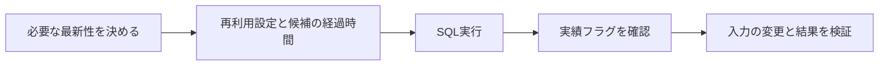

# Athenaの結果再利用と最新性の判断

## 到達目標

結果の再利用設定、今回の再利用実績、結果生成後の入力変更を区別する。既存athena素材を、必要な最新性に合わせたSQL結果の選択へ詳述する。

## 仕組み

StartQueryExecutionでSQLを実行し、ResultReuseConfigurationで過去結果の再利用を設定する。ResultReuseByAgeConfiguration.Enabledは再利用を可能にする設定で既定false。MaxAgeInMinutesは候補の最大経過時間で、指定しない場合の既定は60分。

再利用を有効にしたことと、今回実際に再利用されたことは別。ResultReuseInformation.ReusedPreviousResult=trueは以前の結果を再利用、falseは新しいクエリ実行から結果を生成したことを示す。

## 比較・条件

| 確認 | 意味 | 保証しないこと |
| --- | --- | --- |
| Enabled | 過去結果の再利用を許容 | 今回の結果が必ず再利用されたこと |
| MaxAgeInMinutes | 候補の最大経過時間 | 生成後の入力変更まで含むこと |
| ReusedPreviousResult | 今回の再利用実績 | 将来の別実行も同じ結果になること |
| GetQueryResults | 指定した実行の結果取得 | SQLの再実行 |

生成後に新しいログが追加されたのに、その前に作った結果を再利用した場合、新データも集計済みとは判断できない。最新集計が必要なら再利用を無効にした新しい実行と対象データ・結果を確認する。過去の状態でよい要件なら、許容する鮮度と他の条件を明示して再利用を選べる。

## 限界

最大経過時間だけで再利用の全適格条件を満たすと考えない。SQL/データカタログ/ワークグループ/結果場所などの適格条件の全一覧は別途公式文書で確認する。再利用無効の新実行も、すべての外部入力を同じトランザクション時点に固定する保証ではない。

本単位はSQL最適化、パーティション・列指向形式、実際の費用削減額を検証していない。再利用設定の有効化だけからスキャン量0や一定の高速化を保証しない。実AWSの実行と計測は未実施。結果ファイルの出力先・権限は別の構成説明で扱う。

## ケース問題

正本は `knowledge/game-cases.json` の `athena-result-reuse`。追加ログと過去結果の判断、別集計での再利用実績を独立2問で扱う。

- 経過時間内だから新データもあるという誤答：生成時点と現在を混同している。
- 結果取得でSQLを再実行する誤答：取得と実行は別API。
- 有効設定だけで再利用と判断する誤答：今回の実績を見ていない。
- falseなら永久禁止という誤答：今回の情報を将来の全実行へ広げている。

## 用語・補足

**結果再利用**は前に生成した結果を使うこと。**最大経過時間**は候補結果の年齢の上限。**実績フラグ**は今回どう処理したかを示す情報。**実行ID**は特定のクエリ実行を識別する値で、同じIDの結果取得を繰り返しても新実行ではない。

## 根拠と確認状態

2026-10-07に原稿作成後の内容確認を実施。同一担当確認、独立監査・実AWS実験・本人理解評価は未実施。ゲーム取り込みと公開は別管理。AWS公式リポジトリの固定コミットを無料で閲覧。

- [types.go](https://github.com/aws/aws-sdk-go-v2/blob/2ba0e39015ddf9c91c6c378f8a4fb79dcb4353da/service/athena/types/types.go) — ResultReuseByAgeConfiguration.Enabledは過去結果を再利用可能にする設定で既定false。MaxAgeInMinutesは候補結果の最大経過時間で既定60分。ResultReuseInformation.ReusedPreviousResult=trueは過去結果の再利用、falseは新しい実行の結果。
- [api_op_StartQueryExecution.go](https://github.com/aws/aws-sdk-go-v2/blob/2ba0e39015ddf9c91c6c378f8a4fb79dcb4353da/service/athena/api_op_StartQueryExecution.go) — StartQueryExecutionはSQLを実行し、ResultReuseConfigurationで結果再利用の動作を指定する。
- [api_op_GetQueryResults.go](https://github.com/aws/aws-sdk-go-v2/blob/2ba0e39015ddf9c91c6c378f8a4fb79dcb4353da/service/athena/api_op_GetQueryResults.go) — GetQueryResultsは指定実行IDの結果をS3の結果場所から取得し、SQLを実行しない。実行にはStartQueryExecutionを使う。
