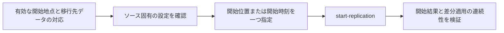

# CDCの開始位置とソース固有の再開条件

## 到達目標

DMSで変更データを指定地点から開始するとき、開始パラメータとソース固有条件を対応付ける。既存cdc素材を再開位置の判断へ具体化する。

## 仕組み

CDC（変更データキャプチャ）はソースの変更を取得して適用する方式。既存タスクの停止位置再開と、新しいCDC専用タスクを指定地点から開始する操作を分ける。後者はstart-replicationと開始位置を指定する。

RecoveryCheckpointはDMSタスクの最後のCDCチェックポイント。対応するCdcStartPositionへ渡してその地点から開始できる。ただし任意のチェックポイントを別データへ流用して安全になる意味ではない。ソース・対象データ・取得できる変更の連続性を確認する。

## 比較・条件

| 指定・確認 | 意味 | 注意点 |
| --- | --- | --- |
| CdcStartPosition | 日付・チェックポイント・ログ位置等 | 形式と対応はソース条件を確認 |
| CdcStartTime | 変更取得の開始時刻 | すべてのソースが時刻開始対応ではない |
| RecoveryCheckpoint | タスクの最後のCDCチェックポイント | 移行先データとの対応も確認 |
| slotName | PostgreSQLソースの既存論理スロット指定 | 有効な開始位置とスロットの存在を検証 |

CdcStartPositionとCdcStartTimeを同時に指定するとエラーになる。DMSが自動で有利な方を選ぶ仕組みではない。APIが受け付ける指定へ直すことと、データを欠落/重複なく適用することも別の確認。

PostgreSQLでCdcStartPositionを使う場合、論理レプリケーションスロットが既に作られ、ソースエンドポイントへ関連付けられていることを確認する。slotNameと開始位置が必要な条件を満たさないとエラーになる。単に任意のスロットを作れば過去のどんな変更も取得できるとは判断しない。

## 限界

新しいCDC専用タスクの指定地点開始が対象。既存full-load-and-cdcを停止位置から再開するresume-processingとは区別する。ソース別のログ形式・ログ保持・タイムゾーン・開始時刻対応の全一覧、スロットの運用手順、完全な切替/ロールバックは未確認。チェックポイントを別エンジンへ同じ形式で渡せるとも考えない。

開始地点を現在時刻へ勝手にずらすと、必要な差分を外す可能性がある。初期データと変更取得の境界を記録し、データ検証と業務上の切替確認を行う。実AWSでのログ/スロット操作、移行や連続性の障害試験は未実施。

## ケース問題

正本は `knowledge/game-cases.json` の `cdc-start-position`。チェックポイントと時刻の二重指定、別のPostgreSQLソースでのスロット不足を独立2問にする。

- 両方指定で自動選択という誤答：両方指定はエラー。
- 任意の今へ変更すれば安全という誤答：必要な差分を外し得る。
- 名前でスロットを代替する誤答：実設定は変わらない。
- 時刻を足してスロットを作る誤答：パラメータの役割とソース条件を混同している。

## 用語・補足

**チェックポイント**は変更追従の再開地点を表す値。**ログ位置**はソースの変更記録中の地点で、書式はエンジンによる。**論理レプリケーションスロット**はPostgreSQLの変更取得に関係するソース側設定。**データの連続性**は初期データと変更適用の境界に欠落や不整合がないこと。API開始の成功だけで確認済みとはしない。

## 根拠と確認状態

2026-10-07に原稿作成後の内容確認を実施。同一担当確認、独立監査・実AWS実験・本人理解評価は未実施。ゲーム取り込みと公開は別管理。AWS公式リポジトリの固定コミットを無料で閲覧。

- [api_op_StartReplicationTask.go](https://github.com/aws/aws-sdk-go-v2/blob/2ba0e39015ddf9c91c6c378f8a4fb79dcb4353da/service/databasemigrationservice/api_op_StartReplicationTask.go) — CDC専用タスクを指定位置から開始するにはstart-replicationと開始位置を指定する。CdcStartPositionとCdcStartTimeの両方指定はエラー。ソースごとの制約があり、すべてのソースで時刻開始に対応するわけではない。PostgreSQLでは既存の論理レプリケーションスロットとエンドポイントのslotNameを確認。
- [types.go](https://github.com/aws/aws-sdk-go-v2/blob/2ba0e39015ddf9c91c6c378f8a4fb79dcb4353da/service/databasemigrationservice/types/types.go) — ReplicationTask.RecoveryCheckpointは最後のCDCチェックポイントで、CdcStartPositionへ渡してそこから開始できる。PostgreSQLSettings.SlotNameの指定ではスロットの存在と有効なCdcStartPositionを検証し、不備でエラーになる。
