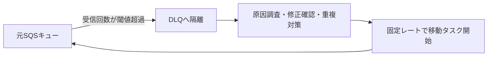

# DLQの隔離と負荷を抑えた再投入

## 到達目標

処理失敗メッセージの隔離と、修正後の再投入を分けて設計する。対象はSQS標準キュー由来のDLQ。保持期間の詳細とFIFOの順序保証、IAM/KMSの詳細設定はこの単位で確認済みとしない。

## 仕組み

DLQ（デッドレターキュー）は、繰り返し処理できないメッセージの隔離先。業務処理の成功を示す保存先ではない。送信元のRedrivePolicyでdeadLetterTargetArnとmaxReceiveCountを指定し、受信回数が閾値を超えたメッセージを隔離する。受信回数はアプリの例外回数そのものではないので、受信して処理に到達しなかった状況も調べる。

隔離先のRedriveAllowPolicyは、どの送信元キューがそのキューをDLQとして使えるかを制限する。これは利用者へのすべてのIAM権限を与える設定ではない。標準キューのDLQは標準、FIFOキューのDLQはFIFOという種別の制約がある。

原因修正・代表データでの処理確認・重複対策を済ませてから再投入する。StartMessageMoveTaskは非同期のメッセージ移動タスクを開始するAPI。このAPIのSourceArnは元の業務キューではなく、移動したいメッセージがあるDLQ。DestinationArnを省略すると、それぞれの元キューへ戻す。指定すれば別の移動先を選べるが、キュー種別・権限などの制約を確認する。

## 比較・条件

| 設定・操作 | 目的 | 注意点 |
| --- | --- | --- |
| RedrivePolicy | 失敗メッセージの隔離 | 原因を直す機能ではない |
| RedriveAllowPolicy | DLQとして使える送信元の制限 | 再投入実行者のIAM権限とは別 |
| StartMessageMoveTask | 隔離済みメッセージを移動 | 移動完了と業務処理成功は別 |
| MaxNumberOfMessagesPerSecond | 固定移動レートの指定 | 下流の成功件数や遅延を保証しない |

固定移動レートは最大500件/秒。省略時は滞留量に応じてシステムがレートを調整し、低い一定レートを保証しない。通常の新規流入と再投入を合わせて、ワーカーや下流の余力を観測する。移動レートを設定しただけで業務処理の成功速度が同じになるわけではない。

## 限界

各キューで同時に実行できる移動タスクは1つ。このAPIは他のSQSキューのDLQを対象とし、LambdaやSNSを送信元とするDLQの再投入には使えない。キューがSQSであるというだけでは適用対象と判断できない。

隔離しても問題データを自動修正しない。修正前の無制限再投入は再失敗を招く。再投入は再実行なので、業務キー・処理済み記録を消して重複防止を解除しない。保持期限まで無期限に残るとは限らず、保持期間設計は別途確認する。

## ケース問題

正本は `knowledge/game-cases.json` の `sqs-dlq-controlled-redrive`。SQS由来DLQの移動元・先・固定レートを選ぶ問題と、Lambda由来DLQへ条件を変更した問題を扱う。

- DLQにあるので成功扱いする誤答：隔離は業務の完了ではない。
- SourceArnに元キューを指定する誤答：移動したいメッセージはDLQ側にある。
- レートを省略すれば必ず低速という誤答：滞留量に応じて変動する。
- Lambda由来でも同じAPIを使う誤答：SQS由来という適用条件を満たさない。

## 用語・補足

**再投入（redrive）**は隔離したメッセージを処理経路へ戻すこと。**ARN**はAWSリソースを識別する名前。**非同期タスク**は開始要求への応答後も処理が続く操作。開始の成功を、移動完了や業務成功と混同しない。**移動レート**は移動するメッセージ数の設定で、処理完了件数とは別。

## 根拠と確認状態

2026-10-07、無料AWS公式SDK固定コミットを原稿作成後に照合。同一担当の内容確認。実AWS実験と独立監査は未実施。公開は未実施。

- [api_op_SetQueueAttributes.go](https://github.com/aws/aws-sdk-go-v2/blob/2ba0e39015ddf9c91c6c378f8a4fb79dcb4353da/service/sqs/api_op_SetQueueAttributes.go) — RedrivePolicyは隔離先とmaxReceiveCountを指定し、受信回数が閾値を超えたメッセージをDLQへ移動。RedriveAllowPolicyは隔離先として使える送信元を制限。標準/FIFOは同じ種別のDLQが必要。
- [api_op_StartMessageMoveTask.go](https://github.com/aws/aws-sdk-go-v2/blob/2ba0e39015ddf9c91c6c378f8a4fb79dcb4353da/service/sqs/api_op_StartMessageMoveTask.go) — 移動元は他のSQSキューのDLQ。DestinationArn省略時は各元キューへ戻る。固定移動レートを指定可能、最大500件/秒。省略時は滞留量で変動。各キューの同時移動タスクは1つ。Lambda/SNS由来DLQは対象外。
