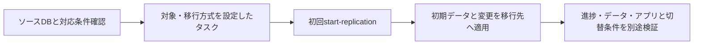

# DMSの初期ロードと変更追従の開始

## 到達目標

初期データを移して継続変更も追従する方式を選び、タスクの初回起動を再開・再ロードと区別する。既存dms素材をタスク操作の条件へ具体化する。

## 仕組み

DMSタスクには送信元/移行先のエンドポイント、レプリケーションインスタンス、テーブルマッピングと移行方式を設定する。エンドポイントは接続するDB、マッピングは対象テーブル等の選択を表す。タスクを作成したことと、開始・データ転送が完了したことは別。

full-load-and-cdcはテーブルデータを移し、その後にソースDBの変更を適用する。稼働中のDBから初期データと継続更新の両方を移す要件に使う。対応DB、変更取得の設定、権限・通信、データ/マッピングの条件を先に確認する。

## 比較・条件

| 方式・操作 | 目的 | 誤った適用 |
| --- | --- | --- |
| full-load | 初期ロード | 継続変更も必ず追従すると考える |
| full-load-and-cdc | 初期データと継続変更 | 対応条件を確認しない |
| cdc | 変更だけの追従 | 空の移行先の初期データもすべて済むと考える |
| start-replication | タスクの初回開始 | 作成と開始を同じ扱いにする |
| resume-processing | 実行済みタスクの処理再開 | 一度も実行していない初回に使う |
| reload-target | 全テーブル再ロードと変更取得 | 単なる停止位置からの再開と混同する |

full-load/full-load-and-cdc/cdcの初回はstart-replicationだけが有効で、初回にresume-processingやreload-targetを使うとデータエラーとなる。実行済みfull-load-and-cdcで停止位置から変更追従を再開するならresume-processing、全テーブルをロードし直して変更取得を始めるならreload-target。full-loadだけの再開では未完了/未ロードのテーブルをロードするため、すべての方式に同じ再開の意味を当てはめない。

## 限界

ここでは通常のレプリケーションタスクを扱い、DMS Serverless全体にAPI操作をそのまま当てはめない。DBごとのCDC対応・ログ設定、データ型・LOB・スキーマ/SQL互換性、遅延・検証・書込み停止・接続先切替の詳細は別の確認が必要。タスク開始が成功しただけで、全機能や全データの移行完了を報告しない。

失敗した特定テーブルを再ロードするReloadTablesもある。全件再ロードや新規作成を唯一の復旧方法にせず、失敗範囲と元/先の状態を確認する。この単位は実AWSの転送・切替試験や停止時間の測定を行っていない。

## ケース問題

正本は `knowledge/game-cases.json` の `dms-start-migration`。第1問は移行方式、第2問は別の未実行タスクの初回操作。条件変更では初期ロード後に停止したタスクの再開を扱う。

- full-loadだけで継続追従という誤答：初期と変更の役割が違う。
- cdcだけで初期全行を移す誤答：初期データの前提がない。
- 初回resume-processingという誤答：実行済みでない。
- 初回reload-targetという誤答：初回開始操作の条件を満たさない。

## 用語・補足

**初期ロード**は既存データの移行。**CDC**は変更データキャプチャで、更新差分の取得を扱う。**タスク**は設定した移行処理。**テーブルマッピング**は対象データの指定。**エンドポイント**は移行元/先へ接続するための設定で、DNSの切替だけでデータを移す意味ではない。

## 根拠と確認状態

2026-10-07に原稿作成後の内容確認を実施。同一担当確認、独立監査・実AWS実験・本人理解評価は未実施。ゲーム取り込みと公開は別管理。AWS公式リポジトリの固定コミットを無料で閲覧。

- [api_op_CreateReplicationTask.go](https://github.com/aws/aws-sdk-go-v2/blob/2ba0e39015ddf9c91c6c378f8a4fb79dcb4353da/service/databasemigrationservice/api_op_CreateReplicationTask.go) — タスクは移行方式、送信元/移行先エンドポイント、レプリケーションインスタンス、テーブルマッピングを指定して作成する。
- [api_op_StartReplicationTask.go](https://github.com/aws/aws-sdk-go-v2/blob/2ba0e39015ddf9c91c6c378f8a4fb79dcb4353da/service/databasemigrationservice/api_op_StartReplicationTask.go) — full-load-and-cdcはテーブルデータ移行後にソース変更を適用。full-load/full-load-and-cdc/cdcの初回実行はstart-replicationのみ。resume-processingは実行済みタスク用。reload-targetは全テーブルを再ロードして変更取得を開始する。
