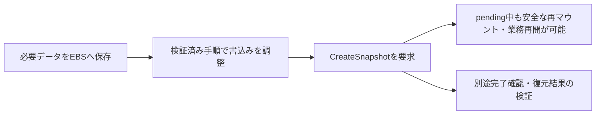

# EBSスナップショットの取得時点と未書込みデータ

## 到達目標

必要なデータを含む取得時点を準備し、元ボリュームの業務再開とバックアップの完了確認を分ける。既存のebs-snapshot素材を、単一データボリュームの取得へ詳述する。

## 仕組み

CreateSnapshotはEBSのスナップショットを作る。取得対象は要求時点までにEBSへ書き込まれたデータで、インスタンスのメモリやアプリ/OSキャッシュを丸ごと保存する機能ではない。必要なファイルがキャッシュにしかなければ、スナップショットに含まれない可能性がある。

必要なデータをアプリの適切な手順で保存し、取得時点の書込みを調整する。公式APIはファイルシステムの書込みを一時停止する方法、難しい場合はインスタンス内でアンマウントして取得する方法を説明している。これはアプリやOSの安全な停止・再開手順を確認して実施する作業で、任意のデータベースに同じ操作だけで完全な整合性を保証する意味ではない。

## 比較・条件

| 観点 | 確認内容 | 混同しないこと |
| --- | --- | --- |
| メモリ/キャッシュ | 必要な変更をEBSへ書き込んだか | インスタンスの実行状態はスナップショット対象ではない |
| 書込み調整 | 取得時点にファイルを安定させる | DB固有の整合性は別途必要 |
| pending | スナップショット作成が進行中 | 元ボリュームを全期間必ず停止する意味ではない |
| 完了/復元検証 | バックアップ結果が使えるか | 要求成功だけで済ませない |

アンマウントして取得要求を行った後、pending中に再マウントして元ボリュームを利用できる。書込み調整が必要な時点と非同期処理全体を同じ停止時間とみなさない。ただし、再マウント可能という性質だけから復旧時間や復元後性能を保証しない。

## 限界

ルートボリュームを取得するときはEC2を停止してから取得することが公式の推奨。これは「どのEBSでも必ずEC2を停止する」という条件とは区別する。暗号化ボリュームのスナップショットは暗号化されるが、それによってキャッシュにしかないデータが保存済みになるわけではない。

複数EBSにまたがるDBの整合性、DBネイティブのバックアップ/ログ、複数ボリューム取得、増分の保持・課金・削除、世代保持と障害訓練は別の設計と確認が必要。実AWSの作成・停止操作、OS別コマンドは未実験。復元したボリュームのファイル・アプリ検査を行って初めて利用可否を確認する。

## ケース問題

正本は `knowledge/game-cases.json` の `ebs-snapshot-capture`。未書込みの必要データを含める準備と、別ボリュームでのpending中再開を独立2問で扱う。

- メモリも必ず含まれる誤答：取得対象を誤認している。
- 暗号化で未書込みを解決する誤答：保護と保存時点は違う。
- pending中ずっと停止が必須という誤答：要求後の再マウントが可能。
- 要求成功で復元確認不要という誤答：アプリの利用可能性を未確認のままにする。

## 用語・補足

**未書込みデータ**はEBSへまだ保存されていない変更。**アンマウント**はOSでファイルシステムの利用を外す操作で、EBSの削除ではない。**pending**は処理中の状態。**取得時点**はバックアップが表す保存状態の基準で、最新のメモリ状態を表すとは限らない。

## 根拠と確認状態

2026-10-07に原稿作成後の内容確認を実施。同一担当確認、独立監査・実AWS実験・本人理解評価は未実施。ゲーム取り込みと公開は別管理。AWS公式リポジトリの固定コミットを無料で閲覧。

- [api_op_CreateSnapshot.go](https://github.com/aws/aws-sdk-go-v2/blob/2ba0e39015ddf9c91c6c378f8a4fb79dcb4353da/service/ec2/api_op_CreateSnapshot.go) — スナップショットは要求時点でEBSへ書き込まれたデータを取得し、アプリ/OSのキャッシュは含まれない場合がある。書込み一時停止またはアンマウントして作成し、pending中でも再マウントして利用できる。ルートボリュームはEC2停止後の取得を推奨。暗号化元のスナップショットは暗号化される。
