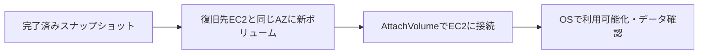

# EBSのスナップショット復元とAZ配置

## 到達目標

完了済みスナップショットから、復旧先EC2で利用できる新しいデータボリュームを作る条件を説明する。既存ebs素材のAZ境界と復元手順を詳述する。

## 仕組み

EBSはEC2へ接続するブロックストレージ。CreateVolumeでは空の新規ボリュームだけでなく、スナップショットから新しいボリュームを作成できる。通常の接続ではEC2とボリュームが同じAZであることが必要。AZ-Aの元ボリュームをAZ-Bへ直接接続する代わりに、利用可能なスナップショットからAZ-Bに新ボリュームを作る。

AZ（アベイラビリティーゾーン）はこの配置条件の単位。ここでは通常AZの同一リージョン復元を扱い、AZ全体の可用性や障害分離の全面レビューとは区別する。

## 比較・条件

| 確認 | 条件 | 混同しないこと |
| --- | --- | --- |
| 配置 | 新ボリュームとEC2は同じAZ | 元ボリュームを別AZへ直接接続しない |
| 容量 | スナップショットと同じか大きい | ファイル使用量だけで小さく復元できない |
| 接続 | 対象インスタンスの接続枠等を満たす | API接続成功とOSでの利用成功は別 |
| 暗号化 | 暗号化スナップショットからのボリュームも暗号化 | 配置条件だけで鍵/権限の条件は解消しない |

100 GiBのスナップショットでファイル使用量が20 GiBでも、CreateVolumeで50 GiBへ直接復元しない。数値は教材用の仮定。縮小が必要なら、対応する別のボリュームへのデータ移行を設計・検証する。容量を大きく作っただけでファイルシステムの拡張が完了するとも考えない。

AttachVolumeは指定デバイスでボリュームを提示する操作。接続後の利用可能化と読み取りをOSで確認する。既存データのある復元ボリュームを、新規空ディスクのつもりで初期化しない。OS別のコマンドはこの教材で検証していない。

## 限界

対象は非ルートデータボリュームの同一リージョン復元。スナップショットの作成時点の整合性は別単位で扱う。接続上限、暗号化対応、Marketplace製品コード、Local Zone/Outpostsの位置制約などをすべて同じ条件へまとめない。実AWSでの復元、復旧時間、初回読取り性能、Fast Snapshot Restore、Multi-Attachは未実験・対象外。

API作成や接続の成功は、アプリの整合性・データ検査・サービス復旧完了を保証しない。復旧先の容量とアクセス条件を確認し、元のデータを保存したまま復元結果を検証する。

## ケース問題

正本は `knowledge/game-cases.json` の `ebs-restore-placement`。別AZへの新規復元と、使用量が少ないスナップショットの容量条件を独立2問で扱う。

- 元ボリュームを別AZへ通常接続する誤答：AZ一致条件を満たさない。
- タグ変更で配置が変わる誤答：名前とリソースの配置は別。
- 使用量だけで小容量へ復元する誤答：元のスナップショット容量に基づく。
- 必ず大きくしなければならない誤答：同じ容量も可能。

## 用語・補足

**ボリューム**は接続するブロックデバイス。**スナップショット**は復元に使うボリュームのバックアップ。**GiB**は容量の単位。**アタッチ**はEC2への接続で、マウントやデータ確認とは別の段階。スナップショットをそのままOSディスクとして接続するのではなく、新ボリュームを作る。

## 根拠と確認状態

2026-10-07に原稿作成後の内容確認を実施。同一担当確認、独立監査・実AWS実験・本人理解評価は未実施。ゲーム取り込みと公開は別管理。AWS公式リポジトリの固定コミットを無料で閲覧。

- [api_op_CreateVolume.go](https://github.com/aws/aws-sdk-go-v2/blob/2ba0e39015ddf9c91c6c378f8a4fb79dcb4353da/service/ec2/api_op_CreateVolume.go) — スナップショットから新しいEBSボリュームを作成できる。ボリュームは接続するインスタンスと同じAZに必要。指定容量はスナップショットと同じか大きい値。暗号化スナップショットからのボリュームも暗号化される。
- [api_op_AttachVolume.go](https://github.com/aws/aws-sdk-go-v2/blob/2ba0e39015ddf9c91c6c378f8a4fb79dcb4353da/service/ec2/api_op_AttachVolume.go) — 接続はデバイスをインスタンスへ提示する操作で、接続後に使用可能にする作業が必要。接続数上限やMarketplace製品コードなどの制約がある。
