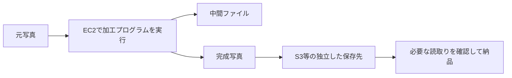

# EC2：処理する場所と保存する場所を分ける

既存単位 `ec2`。写真加工アプリをEC2で実行し、完成写真を後で納品する入門の判断。性能・価格の定量比較、OS運用、全ストレージの耐久性は別単位。

## 仕組み

EC2（Amazon Elastic Compute Cloud）はここでは写真加工プログラムを動かす場所。AMI（Amazon Machine Image）は起動元のイメージで、RunInstancesは利用権限のあるAMIからインスタンスを起動する。インスタンスタイプ、ネットワーク、セキュリティグループ等も選ぶ。起動しただけで加工アプリの設定や保存・アクセス制御が完成するわけではない。

S3はバケットへキーを付けたオブジェクトを保存する場所。EC2で写真を加工し、完成したファイルをS3へ保存するという役割分担ができる。S3を処理サーバーのローカルディスクと同じものとして扱わない。保存要求の成功や必要な読み取りの確認をしてから、処理サーバーの削除を判断する。

## 終了と保存の条件

TerminateInstancesによる終了は不可逆で、インスタンスは復旧できない。インスタンスストアに置いたデータは失われる。EBS（Amazon Elastic Block Store）のボリュームは、終了時削除に設定されたものが削除される。すべてのEBSが常に消える、または必ず残ると一般化しない。`DeleteOnTermination` は終了時削除の設定で、実際の値を確認する。

S3へのPutObjectの成功応答はオブジェクト全体が追加されたことを示す。ローカルに「アップロード予定」と書いただけでは転送完了の証拠にならない。保存先、対象ファイル、内容、必要な権限での読み取りを確認する。特定の担当者だけに見せる権限設計はS3/認可単位へ接続し、今回は全IAM評価を完成した扱いにしない。

## 比較・条件

| 方法 | 適する条件 | 確認する限界 |
|---|---|---|
| 再生成可能な中間ファイルをローカルに置く | 元写真と再処理手順が残り、再計算の時間・費用を許容 | 失ったら再生成できるという前提が必要 |
| 完成写真を独立したS3へ保存する | 処理インスタンス終了後も保持する必要 | 転送・内容・必要なアクセスと保存側の削除条件を確認 |
| 終了時削除falseのEBSを残す | 残したボリュームを別のインスタンスで使う計画がある | インスタンス自体は戻らず、自動で別のアプリから読めるとは限らない |
| EC2を停止する | EBS-backedインスタンスを後で再開する | 終了とは別操作。EBSの料金は続き、永続保存やバックアップの設計を代替しない |

StopInstancesではEBS-backedインスタンスを停止し再開できる。停止中のインスタンス使用料と残るボリュームの料金は区別する。これは停止と終了の比較であり、全購入形態や価格の計算問題ではない。インスタンスストアの停止・再起動等の寿命条件の詳細は別単位の現行資料確認が未完了。

## ケースと誤答理由

正本 `game-cases.json` の `ec2-photo-retention`。第1問は唯一の完成写真を残すため、終了前に独立保存と確認を選ぶ。第2問はEBSの終了時削除設定とEC2自体の不可逆な終了を区別する。全選択肢の不適合条件を説明する。転移問いは失っても再生成できる中間ファイルへ条件を変え、過剰な保存の必要性がどう変わるかを考える。

## 分類とゲーム

`concept-ec2-compute-retention` は処理と保存の分離の概念、`case-ec2-photo-retention` は連続2問。関連章はch01・ch04・ch05・ch12で同じ素材を共有する。新カード効果は未設計。処理カードだけで保存保護まで満たすという説明にしない。

## 出典と確認

無料公開のAWS公式SDK、コミット `2ba0e39015ddf9c91c6c378f8a4fb79dcb4353da`。2026-10-06、Codexが原稿・ケース作成後に条件・誤答を別工程で照合。同一担当であり、別担当者の独立監査・AWS実験・本人理解評価は未実施。

- [RunInstances](https://github.com/aws/aws-sdk-go-v2/blob/2ba0e39015ddf9c91c6c378f8a4fb79dcb4353da/service/ec2/api_op_RunInstances.go)：AMIから起動、ネットワークやタイプ等の設定。
- [TerminateInstances](https://github.com/aws/aws-sdk-go-v2/blob/2ba0e39015ddf9c91c6c378f8a4fb79dcb4353da/service/ec2/api_op_TerminateInstances.go)：終了不可逆、終了時削除のEBS、インスタンスストア、終了前の永続保存。
- [StopInstances](https://github.com/aws/aws-sdk-go-v2/blob/2ba0e39015ddf9c91c6c378f8a4fb79dcb4353da/service/ec2/api_op_StopInstances.go)：停止・再開と残るボリュームの料金。EBS削除の一般化には使わず上記終了APIの条件に従う。
- [PutObject](https://github.com/aws/aws-sdk-go-v2/blob/2ba0e39015ddf9c91c6c378f8a4fb79dcb4353da/service/s3/api_op_PutObject.go)：オブジェクト追加、成功時の全体保存と必要な許可。

AWSドキュメントサイトは環境制約により取得不可。上記で確認できた範囲に限定。Pages公開は未完了。
