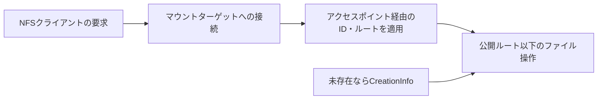

# EFSアクセスポイントのユーザーとルート制御

## 学習目標・適用条件

既存EFSのマウント条件を前提に、アクセスポイントを経由する要求へ何を適用するかを追う。ユーザーIDの上書き、公開ルート、未存在ディレクトリの作成条件を区別する。新しい共有ファイルストレージを増やす話ではない。

## 構成要素

- NFSクライアント：OS側のユーザーID/グループIDを持ち、アクセスポイントを使ってマウントする。
- EFSマウントターゲット：ネットワークの接続先。アクセスポイントとは別の構成要素。
- アクセスポイント：アプリケーション向けにPOSIX IDと公開するパスを適用する。
- PosixUser：経由するファイル操作へ使うUID/GID。
- RootDirectory：クライアントへルートとして公開するパス。
- CreationInfo：そのパスが未存在の場合に作る所有者UID/GID・Permissions。

## 仕組み

図は設定を追う論理的な流れで、アクセスポイントを別のネットワークサーバーとして表すものではない。

アクセスポイントでPosixUserを設定すると、その経由のファイル操作では設定したOSユーザー/グループがNFSクライアントのID情報を上書きする。クライアント2000/2000、設定1001/1001なら1001/1001を適用する。RootDirectory.Path=/apps/team-aなら、そのパスをその経路のルートとして公開し、クライアントはそのルートと配下を扱う。

未存在のルートパスを自動作成するにはCreationInfoへ所有者UID/GIDとPermissionsをそろえる。EFSが作成するのはクライアントがそのアクセスポイントへ接続するとき。パスが存在せずCreationInfoもなければ、そのアクセスポイントによるマウントは失敗する。パス指定だけ、アクセスポイントのID取得だけで作成完了とは判断しない。

## 比較・条件

| 設定 | 決めること | 単独では決まらないこと |
| --- | --- | --- |
| マウントターゲット | ネットワークの接続先 | POSIX IDや公開ルート |
| PosixUser | その経路の操作ID | 全ファイルへの書込み許可 |
| RootDirectory.Path | その経路のルート | 未存在パスの所有者/権限 |
| CreationInfo | 未存在パス作成時の所有者/権限 | 全既存ファイルの権限の自動修正 |

PosixUserは操作ID、CreationInfoは作成時の所有者と権限。役割を区別し、意図するIDで必要な操作が可能かを別に確認する。ネットワークが通ること、マウントできること、ファイルを書けることを同じ判定にしない。

## 異常時・限界

未存在パスで失敗したとき、直ちに通信範囲を広げずCreationInfoまたは事前作成を確認する。IDを上書きしても既存ファイルの所有者や権限がすべて変わるわけではない。

ここでの制御はアクセスポイント経由の要求の範囲。別のマウント経路や別アクセスポイント、IAM/ファイルシステムポリシー、TLS、root権限、POSIX権限の完全な評価、ディレクトリ削除後の再作成や既存パスの更新挙動は別途確認する。アクセスポイントを作ったことだけで全利用経路の隔離やテナント全体の安全性を保証しない。実AWSマウント/権限試験は未実施。

## ケース問題・誤答理由

正本は `knowledge/game-cases.json` の `efs-access-point-scope`。第1問はクライアントIDと設定ID、第2問は未存在パス。ID加算は仕様ではなく、新しいファイルシステムの作成でもない。ターゲット追加はルート作成の代替ではない。変形問題では対象パスが既に存在する場合を考える。

## 用語・補足

**UID/GID**はOSのユーザー/グループを表す番号。**POSIX**はここではファイルパス・所有者・権限などのOS向け規約。**ルートディレクトリ**はその経路の起点として見せるディレクトリ。**Permissions**はディレクトリのモードを表す権限値で、IDそのものとは別。設定例のIDやパスは教材用で、推奨の一律設定ではない。

## 根拠と状態

2026-10-07に原稿作成後に確認。同一担当、独立監査・実AWS試験は未実施。公開は未実施。
- [api_op_CreateAccessPoint.go](https://github.com/aws/aws-sdk-go-v2/blob/2ba0e39015ddf9c91c6c378f8a4fb79dcb4353da/service/efs/api_op_CreateAccessPoint.go) — アクセスポイントはOSユーザー/グループとパスをその経由の要求へ適用し、NFSクライアントのID情報を上書きする。指定パスをクライアントのルートとして公開する。
- [types.go](https://github.com/aws/aws-sdk-go-v2/blob/2ba0e39015ddf9c91c6c378f8a4fb79dcb4353da/service/efs/types/types.go) — PosixUserのUid/Gidはアクセスポイント経由のファイル操作へ使うID。RootDirectoryのパスが未存在ならCreationInfoの所有者UID/GID/Permissionsでクライアント接続時に作成。未存在かつCreationInfoなしではそのアクセスポイントでのマウントが失敗する。
