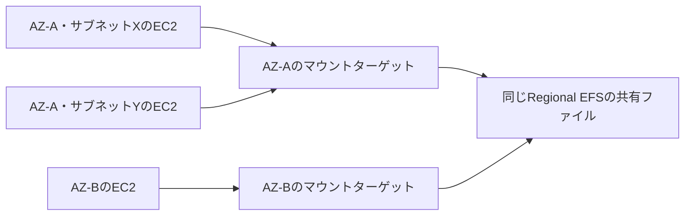

# EFSの共有ファイルとマウントターゲット配置

## 到達目標

共有ファイルと接続先を分け、AZとサブネットの条件を判断する。既存efs素材を詳述し、RegionalとOne Zoneを混同しない。

## 仕組み

EFSはPOSIX対応の共有ファイルストレージ。複数EC2がNFSで同じファイルを読み書きできる。ファイルシステムに保存したデータと、VPC内からアクセスするためのマウントターゲットは別の構成要素。

1つのファイルシステムのマウントターゲットは1つのVPC内に作り、1AZにつき1つ。あるAZに複数サブネットがあっても、そのうち1つに作り、そのAZのEC2で共有できる。EC2が同じサブネットにいることは必要条件ではない。ただし経路・DNS・通信許可・NFSクライアント・ファイル権限の条件は別に満たす。

この図はRegionalの例。One Zoneのマウントターゲットは1つだけで、そのファイルシステムと同じAZに作る。別AZへターゲットを増やしてRegionalへ変える方法ではない。One Zoneのクライアントが別AZにいては絶対に使えない、という一般化もしない。

## 比較・条件

| 構成 | 接続と配置 | 判断の注意 |
| --- | --- | --- |
| Regional EFS | 1VPC内、各AZに1ターゲット | 各AZのEC2と同じAZの接続先を推奨 |
| One Zone EFS | ファイルシステムと同じAZに1ターゲット | Regionalの図や配置条件を流用しない |
| EBS | ブロックボリュームをEC2へ接続 | 通常接続では同じAZ。複数AZのNFS共有の代替と決めつけない |

複数EC2で同じNFSファイルを使いたいならEFSの共有方式を検討する。EC2のブロックデバイスとして使う要件はEBSと比較する。EBSの通常接続・Multi-Attach・共有ファイルの違いを無視し、「EBSはどんな構成でも共有不能」とはしない。

ファイルシステムの作成APIはcreatingの状態で戻る。availableになってからマウントターゲットを作る。ターゲットの作成APIもcreatingのまま戻るため、作成状態を確認する。IDが得られたことと、EC2でのマウント・読書き成功は別。

CDKのEFS接続の既定ポートはTCP 2049。対象ターゲットへの必要な通信に絞り、経路/DNS/NACL/SGとNFS・ファイル権限を分けて確認する。ネットワーク許可があっても、ファイルの書込み権限が自動で付くわけではない。

## 限界・異常時

同じAZ内の別サブネットというだけで接続失敗と判断しない。Regionalでは各利用AZにターゲットを置くことが推奨され、別AZのターゲットを使うと費用や、そのターゲットのAZ障害によるアクセス不能を考慮する。推奨配置と絶対必須を区別する。

確認範囲は同一VPC。VPC外/オンプレミス/クロスVPC、Windows SMB、NFSロック/整合性、性能/スループット/料金、全IAM・POSIX評価、暗号化やアクセス点による制御は別途確認。実AWSでのマウント試験は未実施。

## ケース問題・誤答理由

正本は `knowledge/game-cases.json` の `efs-mount-placement`。第1問は同一AZの別サブネット、第2問はOne Zoneの配置。サブネットごとの追加という誤答はAZ単位の制約を無視する。別ファイルシステム作成は既存ファイルの共有ではなく、ターゲット追加は配置方式の変更ではない。変形問題でRegionalの別AZ接続先を考える。

## 用語・補足

**POSIX**はここではパス・所有者ID・ファイル権限などのOS向けインターフェース規約。**NFS**はネットワーク経由のファイルアクセス方式。**マウント**はファイルシステムをクライアントで利用可能にする操作。**マウントターゲット**はVPC内の接続先。**AZ**はここではターゲットの配置条件を決める区域。**サブネット**はVPC内のIPアドレス範囲で、1つのAZに属する。

## 根拠と確認状態

2026-10-07に原稿作成後の内容確認を実施。同一担当確認、独立監査・実AWS実験・本人理解評価は未実施。ゲーム取り込みと公開は別管理。AWS公式リポジトリの固定コミットを無料で閲覧。

- [api_op_CreateMountTarget.go](https://github.com/aws/aws-sdk-go-v2/blob/2ba0e39015ddf9c91c6c378f8a4fb79dcb4353da/service/efs/api_op_CreateMountTarget.go) — 1ファイルシステムのマウントターゲットは1VPC内・1AZにつき1つ。同じAZの複数サブネットで共有でき、EC2と同じサブネットである必要はない。One Zoneはファイルシステムと同じAZに1つだけ作る。
- [api_op_CreateFileSystem.go](https://github.com/aws/aws-sdk-go-v2/blob/2ba0e39015ddf9c91c6c378f8a4fb79dcb4353da/service/efs/api_op_CreateFileSystem.go) — ファイルシステム作成要求はcreatingで戻り、availableになってからマウントターゲットを作る。
- [README.md](https://github.com/aws/aws-cdk/blob/6ede0060d93bab5903a0528bdd323a56e1430003/packages/aws-cdk-lib/aws-efs/README.md) — EFSはPOSIX対応の共有ファイルストレージで複数EC2の同時読書きを提供し、NFSによるマウント例と接続許可の設定を持つ。
- [efs-file-system.ts](https://github.com/aws/aws-cdk/blob/6ede0060d93bab5903a0528bdd323a56e1430003/packages/aws-cdk-lib/aws-efs/lib/efs-file-system.ts) — FileSystem.DEFAULT_PORTは2049。connectionsの既定ポートはTCPでその値を使う。
- [api_op_AttachVolume.go](https://github.com/aws/aws-sdk-go-v2/blob/2ba0e39015ddf9c91c6c378f8a4fb79dcb4353da/service/ec2/api_op_AttachVolume.go) — EBSはEC2へ接続するボリューム。VolumeIdの接続条件はボリュームとEC2が同じAZであること。
