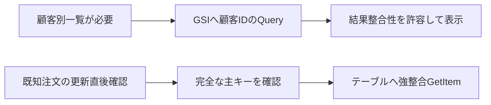

# DynamoDB：GSI検索と最新値の読取りを分ける

既存素材ID `gsi`、ch06-l02の初の詳細単位。単一リージョンのDynamoDBテーブルとGSIを扱う。グローバルテーブル、複数項目のトランザクション整合性、レプリケーション全設計は範囲外。

## 仕組み

DynamoDBはキーで項目へアクセスするデータベース。テーブルの主キーは対象項目を指定する値。GSI（Global Secondary Index、グローバルセカンダリインデックス）はテーブルとは異なるキーによる検索先を用意する。注文IDの主キーだけでは顧客別の注文一覧のQueryは組めないため、顧客IDをGSIのパーティションキーにする、というアクセスパターンを設計する。

Queryは対象テーブルまたはインデックスのパーティションキーに単一値を指定する。任意属性をFilterExpressionへ書けばキー条件が不要になるわけではない。ソートキーがあるなら条件で絞れる。結果のフィルターは読取り後に適用され、絞った結果だけの読取り料金になるとは説明しない。この詳細は次の単位へ残す。

## 整合性と使える条件

GSIへのQueryは結果整合性だけをサポートし、ConsistentRead=trueにするとValidationExceptionになる。結果整合性は成功した更新が検索に直ちに現れる保証ではない。GSIが最新値を返さないだけで、更新失敗や注文不在の証拠とは判断しない。

テーブルとLSI（Local Secondary Index、ローカルセカンダリインデックス）へのQueryでは強い整合性を指定できる。GetItemはテーブルの完全な主キーで1項目を取り出す操作で、既定は結果整合性。ConsistentRead=trueで強い整合性の読取りを選べる。GSI名をGetItemへ渡して索引を強整合化する操作ではない。

単一リージョンで成功済みの更新をその後に確認し、さらに別の更新はないという本ケースでは、完全な主キーが既知ならテーブルへの強整合GetItemを選べる。しかしGSIにまだ出ない新項目のキーを、GSI検索だけで必ず発見できるという保証はない。主キーの有無と検索要件を先に確認する。

## 比較・条件

| 操作先 | キーと目的 | 整合性・限界 |
|---|---|---|
| GSIのQuery | GSIキーによる一覧 | 結果整合性のみ。最新項目の欠落も考慮 |
| テーブルのGetItem | 完全な主キーで1項目 | ConsistentRead=trueを選べるが任意属性検索ではない |
| テーブル/LSIのQuery | 対象のパーティションキーと任意のソート条件 | 強整合を指定可能。GSIと同一視しない |
| GSI結果を得てテーブルで再読取り | 発見できた既知項目の内容を再確認 | GSIから漏れた項目まで発見できるとは限らない |

強い整合性を選ぶことは、複数操作の業務判断を原子的にすることではない。読み取り後の競合更新や、複数項目の整合は別に設計する。索引の投影・キー偏り・スループット/料金の定量設計は未完了。

## ケースと誤答理由

正本 `game-cases.json` の `dynamodb-gsi-order-read`。第1問は顧客別一覧のGSIと結果整合性、第2問は成功した更新後の既知注文の確認。全選択肢へ不適合なキー/整合性の理由を付ける。転移問いは完全な主キーが未知で、顧客別の最新一覧が必須へ変更し、GSIへの強整合指定では要件を満たせないと考える。

## Queryの空ページ・継続キー・フィルター容量

QueryはLimitの評価項目数または最大1MBまで読み、その後にFilterExpressionを適用する。Itemsが空でもLastEvaluatedKeyがあれば終端とは限らない。その値を次の要求のExclusiveStartKeyへ渡し、同じキー/索引/条件で続ける。継続キーがあるだけで次ページに一致項目があると断定しない。継続キーが空になったときにページングの終端を判断する。

FilterExpressionやProjectionExpressionで返す内容を減らしても、同じ対象サイズ・読取り条件では読取り容量は減らない。容量は返した結果だけでなく、読んだ対象のサイズと読取り条件に基づく。Countはフィルター後、ScannedCountは評価した数。両方の意味を分け、必要ならReturnConsumedCapacityで容量の情報を取得する。単位あたりの価格・上限や厳密な課金額の実測はここで行っていない。

FilterExpressionにはパーティション/ソートキー条件を移さず、KeyConditionExpressionで指定する。大量に捨てる検索なら、必要なアクセスパターンとキー/索引を再検討する。ページングを最後まで行うことはGSIの結果整合性を強整合へ変えることではない。更新中の全ページを同一時点のスナップショットとみなさない。

追加ケースdynamodb-query-filter-pagesは空ページの継続と、100項目を評価し2項目を返す架空の比較を扱う。2026-10-07、下記公式Queryを作成後に同一担当の別工程で照合。独立監査・AWS容量測定は未実施。既存のGSIカード素材を分割せず共有する。

## 分類とゲーム

concept-gsi-query-consistencyは概念、case-dynamodb-gsi-order-readはケース。ch06/ch08/ch12で共有し、既存155素材のGSIを詳細化する。新カード効果は未設計で、一覧検索と最新確認を同じ万能効果へまとめない。

## 出典・確認

無料公開のAWS公式SDK、コミット `2ba0e39015ddf9c91c6c378f8a4fb79dcb4353da`。2026-10-07、Codexが作成後にキー条件・GSIの例外・GetItemと全誤答を別工程で照合。同一担当であり、別担当者の独立監査・実AWS試験・本人理解評価は未実施。

- [Query](https://github.com/aws/aws-sdk-go-v2/blob/2ba0e39015ddf9c91c6c378f8a4fb79dcb4353da/service/dynamodb/api_op_Query.go)：対象のキー条件、GSIは結果整合性のみ、true指定時のValidationException、テーブル/LSIの強整合、後段フィルター。
- [GetItem](https://github.com/aws/aws-sdk-go-v2/blob/2ba0e39015ddf9c91c6c378f8a4fb79dcb4353da/service/dynamodb/api_op_GetItem.go)：完全な主キー、既定の結果整合性と強整合指定。

現在のAWS公式サイトは取得制約があり、SDKで確認した範囲へ限定。元の第6章全体を監査済み/公開済みに変えない。
