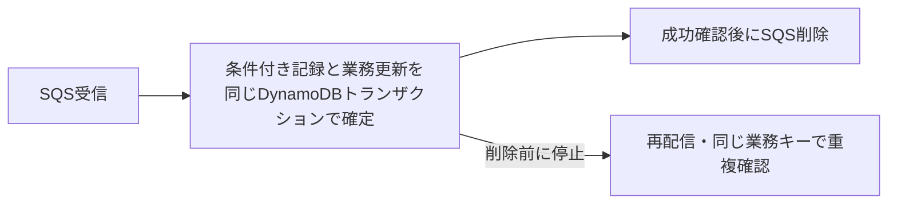

# SQS再配信と業務更新の冪等性

## 到達目標

標準SQSの再配信を前提に、DynamoDB内の業務更新を二重に実行しない構成を説明する。対象は同一アカウント・リージョンで、外部APIへの副作用は含めない。

## 仕組み

冪等性とは、同じ業務操作を繰り返しても、結果が一度実行した場合と同じになる性質。SQSから受信した後に処理を完了しても、DeleteMessageの前にワーカーが停止すれば再配信され得る。標準キューでは削除後にもまれな再受信があり、削除だけに重複防止を任せない。

注文IDと操作種別・版など、再配信でも変わらない業務キーを使う。ReceiptHandleは受信ごとに変わる削除用のハンドルで、業務キーとは別物。最新のハンドルで削除する。

DynamoDBで、処理済み記録の条件付きPutと業務レコードのUpdateをTransactWriteItemsにまとめる。記録と業務レコードは異なる項目とし、主キー属性にattribute_not_existsを指定して、既存の処理済み記録を上書きしない。このトランザクションは全成功か全失敗となる。

1. 安定した業務キーと操作内容を確定する。
2. 処理済み記録の新規作成と業務更新を同じトランザクションで確定する。
3. 成功を確認してからSQSメッセージを削除する。
4. 再配信時は、同じ業務キーへの条件付き記録が重複更新を防ぐ。既存記録が意図した操作と一致することを確認してから、最新ハンドルで削除する。

処理済み記録を先に単独で作ると、その後の更新前に停止して未実行を処理済み扱いする危険がある。更新だけを先に行うと、記録前の停止で二重更新となる。原子的な確定がこの隙間をなくす。応答タイムアウトでは成否が不明なので、永続記録の確認や安全な再試行が必要。容量不足・競合・別条件の不成立など、すべての失敗を「既に処理済み」と解釈して削除してはいけない。

## 比較・条件

| 手段 | 担当する問題 | 限界 |
| --- | --- | --- |
| 可視性タイムアウト | 処理中の再取得を抑える | 停止や期限超過、削除後の再配信まで排除しない |
| 最新ReceiptHandleで削除 | 受信したメッセージの削除要求 | 永続的な業務重複防止ではない |
| ClientRequestToken | 同一トランザクション要求の再試行 | 最初の完了後10分間。期限内にパラメータを変えると不一致エラー |
| 業務キーの条件付き記録＋原子的更新 | 長期の業務操作重複を防ぐ | 記録の保持・キー設計・失敗理由の確認が必要 |

ClientRequestTokenは、最初のリクエストが完了してから10分を超えると同じ値でも新しいリクエストとして扱われる。何日後の再配信も抑える保証にはならない。処理済み記録は想定する再配信・再処理期間に合わせて保持し、削除すると過去の操作を再実行できる点を確認する。

## 限界

同じトランザクションで同じ項目へ複数のアクションは実行できない。ここでは記録と業務データを異なる項目にする。アカウント・リージョン、項目数・サイズ、容量や競合などの制約も満たす必要がある。DynamoDBの原子性はSQS削除や外部決済・メール送信を含まない。外部副作用にはoutboxや送信先の冪等キーなど別の設計と根拠確認が必要で、この単位では実装しない。

## ケース問題

正本は `knowledge/game-cases.json` の `sqs-dynamodb-commit-gap`。業務更新後の停止と、初回完了15分後のトークン再使用を独立した2問で扱う。

- メモリだけに処理済み情報を持つ誤答：停止すると情報が失われる。
- 業務確定前にメッセージを削除する誤答：停止すると未実行の業務を失う。
- 同じトークンなら永久に再更新されないという誤答：10分間の保証を超える。
- ハンドルで業務を識別する誤答：再受信でハンドルが変わる。

## 用語・補足

**処理済み記録**は業務操作が確定したことを永続的に記録する項目。**条件付き書込み**は指定した条件を満たす場合だけ変更する操作。**原子性**は複数変更をすべて確定するか、一つも確定しない性質。**リクエストトークン**は短期の同一API要求を識別する値で、長期の業務キーとは役割が異なる。

## 根拠と確認状態

無料のAWS公式SDKリポジトリの固定コミットを確認。原稿作成・内容確認・分類・ゲーム取り込み・公開は別管理。2026-10-07に同一担当が原稿作成後の内容確認を実施。実AWSの障害実験と独立監査は未実施。公開は未実施。

- [api_op_DeleteMessage.go](https://github.com/aws/aws-sdk-go-v2/blob/2ba0e39015ddf9c91c6c378f8a4fb79dcb4353da/service/sqs/api_op_DeleteMessage.go) — SQSは受信ごとに新しいReceiptHandleを発行し、削除には最新ハンドルが必要。標準キューでは削除後もまれに再受信があるため、アプリケーションに冪等性が必要。
- [api_op_TransactWriteItems.go](https://github.com/aws/aws-sdk-go-v2/blob/2ba0e39015ddf9c91c6c378f8a4fb79dcb4353da/service/dynamodb/api_op_TransactWriteItems.go) — 同じアカウント・リージョン内の異なる項目への条件付きPutとUpdateを原子的に実行できる。全成功または全失敗。ClientRequestTokenの同一リクエスト保証は最初の完了後10分間で、以後は新規として扱う。
- [api_op_PutItem.go](https://github.com/aws/aws-sdk-go-v2/blob/2ba0e39015ddf9c91c6c378f8a4fb79dcb4353da/service/dynamodb/api_op_PutItem.go) — 主キー属性へのattribute_not_exists条件で既存項目の上書きを防げる。
