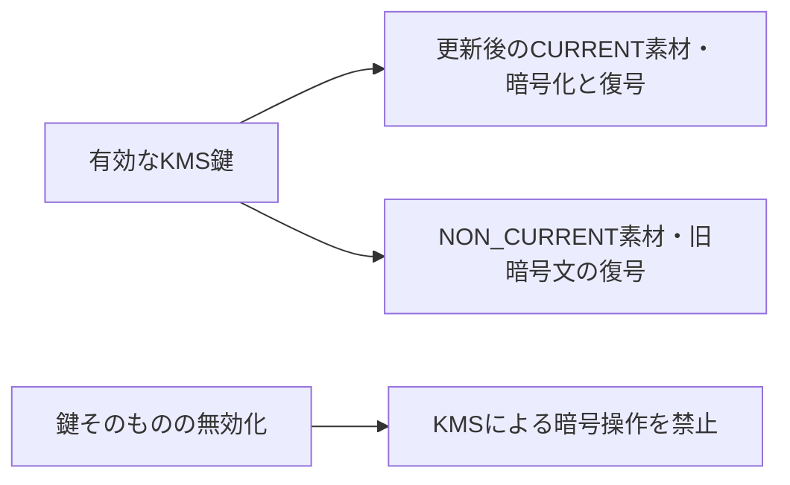

# KMS鍵素材の更新と旧暗号文の復号

## 到達目標

鍵素材の更新と旧暗号文の復号を区別し、適用できる更新方式を選ぶ。既存kms素材を詳述する。DB資格情報の更新や保存データの全面書換えとは別の操作として説明する。

## 仕組み

KMS鍵は暗号操作の対象となるリソースで、鍵素材はその暗号処理に使用する材料。素材の更新では新しい素材がCURRENTとなり、以前の素材はNON_CURRENTとして復号用に扱われる。CURRENTは暗号化と復号、NON_CURRENTは復号用。更新したから古い暗号文は直ちに復号できない、とは考えない。鍵が有効で、必要な権限や暗号文の条件を満たすことも必要。

自動更新は定期的な素材の更新。対象の顧客管理鍵は、既定で有効化後365日ごとに更新し、対応する設定で周期を変更できる。オンデマンド更新は必要時の素材更新で、既存の自動更新予定を変えない。自動更新を有効にしていることと、直近の更新が完了したことを同一視しない。

## 比較・条件

| 操作・設定 | 役割 | 条件・限界 |
| --- | --- | --- |
| 自動更新 | 定期的に鍵素材を更新 | 対称暗号化鍵。インポート素材/非対称/HMAC/カスタムキーストアは対象外 |
| オンデマンド更新 | 必要時に対応鍵の素材を更新 | 顧客管理の対称鍵。既存予定を変更しない。素材生成元の条件も確認 |
| 鍵の無効化 | 鍵による暗号操作を止める | 更新とは異なり復号にも影響 |
| 資格情報の更新 | DBパスワード等の変更 | KMS素材の更新では実行されない |

AWS生成の顧客管理・対称暗号化鍵でまず判断する。オンデマンド更新は自動更新の有無によらず利用できるが、すべての鍵に対応する意味ではない。特にインポート素材は自動更新の対象外でも、対称鍵のオンデマンド更新には新しい素材のインポート等の条件がある。「インポート鍵は一切更新できない」とまとめない。実際のインポート手順はこの単位の確認範囲外。

AWS管理鍵の自動更新周期を利用者が設定するわけではない。顧客管理とAWS管理・AWS所有を区別する。マルチリージョン鍵の自動設定はプライマリ側で扱うが、全リージョンの運用設計を本単位で確認済みにはしない。

## 内容確認・監査

GetKeyRotationStatusで有効状態・周期・次回予定と進行中の更新を確認し、ListKeyRotationsで完了した素材更新の履歴を確認する。API開始の成功を更新完了と同一視しない。取得した状態はKMSの結果整合性も考慮し、即時に全取得結果が一致すると決めつけない。

## 限界

鍵素材の更新は保存先の全ファイルを書き換える作業ではない。外部データの再暗号化や保護鍵の変更には、データ形式と対象を確認した別の設計が必要。旧素材の復号利用も、鍵削除・無効化・権限喪失から保護される保証ではない。鍵素材更新がDBパスワード、S3オブジェクト権限、DB認可を変更するとは考えない。

オンデマンド更新には鍵ごとの回数上限や対応状態があるため、実行前に現行APIの条件を確認する。ここでは実AWSでの更新実験、費用・回数上限の運用設計、外部キャッシュした平文鍵の失効を検証していない。

## ケース問題

正本は `knowledge/game-cases.json` の `kms-rotation-lifecycle`。旧素材の役割と、別鍵でのオンデマンド更新後の予定を独立2問で扱う。

- 旧素材は即時に使えなくなるという誤答：NON_CURRENTは復号用。
- 復号のために鍵を無効化する誤答：暗号操作を止める方向になる。
- 365日へ必ず予定をリセットする誤答：既存予定は変わらない。
- DBパスワードの更新という誤答：資格情報と暗号鍵素材を混同している。

## 用語・補足

**鍵素材**は暗号計算に使う材料。**ローテーション**は素材の更新。**CURRENT/NON_CURRENT**は素材の役割を表す状態。**顧客管理鍵**は利用者が管理するKMS鍵。**無効化**は鍵リソースの使用を停止する操作で、過去の暗号文を平文へ戻すことではない。

## 根拠と確認状態

2026-10-06に原稿作成後の内容確認を実施。同一担当確認、独立監査・実AWS実験・本人理解評価は未実施。ゲーム取り込みと公開は別管理。AWS公式リポジトリの固定コミットを無料で閲覧。

- [api_op_EnableKeyRotation.go](https://github.com/aws/aws-sdk-go-v2/blob/2ba0e39015ddf9c91c6c378f8a4fb79dcb4353da/service/kms/api_op_EnableKeyRotation.go) — 自動更新は対称暗号化鍵に対応し、非対称/HMAC/インポート鍵素材/カスタムキーストアは対象外。顧客管理鍵の既定周期365日。AWS管理鍵の周期を利用者は設定しない。
- [api_op_RotateKeyOnDemand.go](https://github.com/aws/aws-sdk-go-v2/blob/2ba0e39015ddf9c91c6c378f8a4fb79dcb4353da/service/kms/api_op_RotateKeyOnDemand.go) — 対応する顧客管理の対称暗号化鍵は自動更新の有無に関係なくオンデマンド更新でき、既存の自動更新予定は変わらない。非対称/HMAC/カスタムキーストアは対象外。インポートした対称鍵素材には追加のインポート条件がある。
- [types.go](https://github.com/aws/aws-sdk-go-v2/blob/2ba0e39015ddf9c91c6c378f8a4fb79dcb4353da/service/kms/types/types.go) — RotationsListEntryのCURRENT鍵素材は暗号化/復号に、NON_CURRENTは復号だけに使用する。両状態は自動/オンデマンド更新対応鍵に適用。
- [api_op_DisableKey.go](https://github.com/aws/aws-sdk-go-v2/blob/2ba0e39015ddf9c91c6c378f8a4fb79dcb4353da/service/kms/api_op_DisableKey.go) — KMS鍵の無効化は、その鍵を暗号操作に使用することを一時的に禁止する。
- [api_op_GetKeyRotationStatus.go](https://github.com/aws/aws-sdk-go-v2/blob/2ba0e39015ddf9c91c6c378f8a4fb79dcb4353da/service/kms/api_op_GetKeyRotationStatus.go) — 自動更新の有効状態・周期・次回予定と進行中オンデマンド更新を確認できる。
- [api_op_ListKeyRotations.go](https://github.com/aws/aws-sdk-go-v2/blob/2ba0e39015ddf9c91c6c378f8a4fb79dcb4353da/service/kms/api_op_ListKeyRotations.go) — 指定KMS鍵の鍵素材に関する情報と完了した更新の詳細を取得する。
