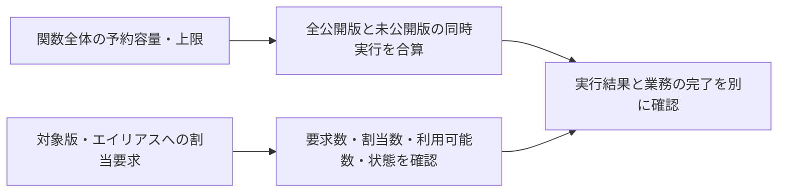

# Lambdaの同時実行上限と割当状態

## 到達目標

関数全体の同時実行上限と、特定版・エイリアスへの容量割当を分ける。既存lambda-concurrency素材を、設定対象と実際の状態の判断へ詳述する。

## 仕組み

予約済み同時実行（Reserved Concurrency）は関数全体の同時実行容量を予約し、その水準を超えて拡大することを防ぐ。全公開バージョンと未公開版を含む。予約5でv1が3、v2が2同時実行中なら合計5であり、各版に5ずつ使える設定ではない。

同時実行数は同時に進行中の実行数。累計呼出し回数や毎秒リクエスト数と同じ値ではない。アカウントの空き枠があっても関数の予約上限は別に評価する。直接Invokeで関数上限を超える場合、TooManyRequestsExceptionの関数予約上限による理由を確認する。再試行やキューの動作は呼出し経路により違う。

プロビジョニング済み同時実行（Provisioned Concurrency）の設定は、バージョンまたはエイリアスに対する割当を扱う。PutProvisionedConcurrencyConfigで要求し、GetProvisionedConcurrencyConfigで対象の設定・状態を確認する。要求数（Requested）、割当数（Allocated）、利用可能数（Available）、処理Statusは別々の情報。本教材のRequested/Allocated/Availableは、それぞれRequestedProvisionedConcurrentExecutions/AllocatedProvisionedConcurrentExecutions/AvailableProvisionedConcurrentExecutionsの略記。既知のStatusはIN_PROGRESS（割当中）/READY/FAILED。要求5でもAvailable=0・割当中なら、5枠が準備完了したとは扱わない。

## 比較・条件

| 情報/設定 | 対象と役割 | 保証しないもの |
| --- | --- | --- |
| 予約済み同時実行 | 関数全体の予約容量と上限 | 版ごとに独立した同数の枠 |
| プロビジョニング済み割当要求 | 対象版またはエイリアスの要求 | 全版への同一割当、即時の割当完了 |
| Requested | 要求した割当数 | 利用可能数と常に同一 |
| Allocated / Available / Status | 割当と現在の利用可能な状態 | 業務処理の成功・下流の処理能力 |

下流DBや外部APIを守るために同時実行上限を検討できるが、1関数内の接続数や再試行、他のアクセス経路まで一律に抑える設定ではない。希望する同時実行数と下流の安全な負荷を計測して比較する。

## 異常時・限界

スロットリングではアカウント上限と関数予約上限を分け、空き枠だけを見て無制限に再試行しない。割当失敗はStatusReasonを確認する。要求が受理されたことだけで、想定の割当が利用可能になったとは判断しない。

確認範囲は設定の対象と状態。プロビジョニング済みの初期化遅延短縮の詳細、正確な費用、予約/割当の数値制約の全組合せ、重み付きエイリアス、上限超過時の全再試行/待機、イベントソースごとの並列度、耐久関数やテナント分離等の互換性は別途確認。実AWSの負荷/割当試験は未実施。

## ケース問題・誤答理由

正本は `knowledge/game-cases.json` の `lambda-concurrency-allocation`。第1問は同一関数の版ごとの実行を合算する。別々に5ずつという誤答は設定範囲を無視する。第2問でRequestedをAvailableへ読み替える誤答は要求と実績を混同し、予約上限の変更は割当完了の保証ではない。変形問題で1実行が終了した場合を考える。

## 用語・補足

**同時実行**は同時に進行する関数実行。**バージョン**は公開した関数の版。**エイリアス**は公開版を指す名前。**スロットリング**は制限により要求の実行が抑えられること。**StatusReason**は割当が失敗した理由。業務の成功・待ち行列の保持と別の観点で確認する。

## 根拠と確認状態

2026-10-07に原稿作成後の内容確認を実施。同一担当確認、独立監査・実AWS実験・本人理解評価は未実施。ゲーム取り込みと公開は別管理。AWS公式リポジトリの固定コミットを無料で閲覧。

- [api_op_PutFunctionConcurrency.go](https://github.com/aws/aws-sdk-go-v2/blob/2ba0e39015ddf9c91c6c378f8a4fb79dcb4353da/service/lambda/api_op_PutFunctionConcurrency.go) — 予約済み同時実行は関数全体（全公開バージョンと未公開版）の同時実行の容量を予約し、その上限を超えて拡大することを防ぐ。
- [api_op_Invoke.go](https://github.com/aws/aws-sdk-go-v2/blob/2ba0e39015ddf9c91c6c378f8a4fb79dcb4353da/service/lambda/api_op_Invoke.go) — 同時実行上限の超過はTooManyRequestsExceptionとなり、アカウントと関数予約上限のエラーを区別する。
- [api_op_PutProvisionedConcurrencyConfig.go](https://github.com/aws/aws-sdk-go-v2/blob/2ba0e39015ddf9c91c6c378f8a4fb79dcb4353da/service/lambda/api_op_PutProvisionedConcurrencyConfig.go) — プロビジョニング済み同時実行の割当はバージョンまたはエイリアスに設定。応答はRequested/Allocated/Availableの各数と割当処理Status/失敗StatusReasonを持つ。
- [api_op_GetProvisionedConcurrencyConfig.go](https://github.com/aws/aws-sdk-go-v2/blob/2ba0e39015ddf9c91c6c378f8a4fb79dcb4353da/service/lambda/api_op_GetProvisionedConcurrencyConfig.go) — 特定バージョン/エイリアスの設定で要求数・割当数・利用可能数と処理Status/失敗理由を取得できる。要求数だけで利用可能数は判断しない。
- [enums.go](https://github.com/aws/aws-sdk-go-v2/blob/2ba0e39015ddf9c91c6c378f8a4fb79dcb4353da/service/lambda/types/enums.go) — ProvisionedConcurrencyStatusEnumの既知の割当状態はIN_PROGRESS/READY/FAILED。
