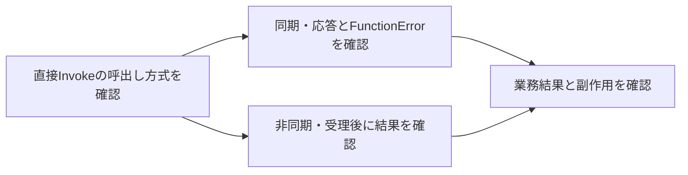

# Lambdaの同期・非同期呼出しと成功判定

## 到達目標

通常Lambdaへの直接Invokeで、要求の成功と実行結果、業務の完了を分ける。既存lambda素材を呼出し方式と再試行の判断へ詳述する。

## 仕組み

Lambdaは関数を同期または非同期に呼び出せる。InvokeのInvocationType=RequestResponse（既定）は関数応答かタイムアウトまで接続を保持し、関数の応答を返す。Eventは非同期で、Lambdaがイベントをキューへ入れて処理する。API応答はステータスのみで、関数の処理完了を待った結果ではない。

成功したAPI要求のHTTPコードは同期200、非同期202。コードだけでは関数エラーを表さない。同期ではFunctionErrorとPayloadのエラー情報も確認する。非同期202の時点で業務更新まで完了したと決めない。

## 比較・条件

| 方式/情報 | 確認する内容 | 成功と混同しないもの |
| --- | --- | --- |
| RequestResponse / HTTP 200 | 同期の要求応答、FunctionError/Payload | 関数内エラーなし・業務更新完了 |
| Event / HTTP 202 | 非同期要求の受理 | 関数の最終結果 |
| DryRun / HTTP 204 | パラメータと呼出し権限の検証 | 関数コードの実行 |
| 実行ログ/トレース/業務結果 | 実際の処理と副作用 | API要求だけの成功 |

## 再試行と限界

再試行はエラー種別・クライアント・イベントソース・呼出し方式で違う。非同期の関数エラーは既定でLambdaが2回再試行するが、非同期実行設定で最大回数やイベント年齢を変更できる。既定の保持は最大6時間で、全試行失敗やキュー内の期限超過で破棄される。DLQや失敗送信先で保持・調査する設計も検討する。

この2回という規則を、同期応答やSQS再配信、すべてのエラーへ流用しない。同期のエラーに再試行で対処する場合も、呼出し側の設定と実行済み副作用を確認する。通信失敗の再試行と関数内エラーへの対処を一律に扱わない。

非同期ではエラーがなくても同じイベントを複数回受け取る場合がある。既存idempotency教材で扱った処理IDと確定境界を共有し、重複イベントを重複した業務更新へ直結させない。

確認範囲は通常関数の直接Invoke。耐久関数、レスポンスストリーミング、サービスごとのイベントソースマッピング、スロットリング/システムエラーの完全な待機・再試行規則、SDKの全設定、送信先の完全な権限・配信保証は別途確認。実AWS呼出し試験は未実施。

## ケース問題・誤答理由

正本は `knowledge/game-cases.json` の `lambda-invocation-result`。第1問は非同期の受理、第2問は同期200に含まれる関数エラー。HTTPコードを業務成功にする誤答は結果情報を無視する。既定2回を同期の成功証拠にする誤答は方式と再試行を混同する。変形問題でDryRunによる検証を区別する。

## 用語・補足

**Invoke**は関数を呼ぶAPI。**InvocationType**は呼出し方式。**FunctionError**は応答内の関数実行エラーの情報。**Payload**はここでは関数応答またはエラー内容。**業務完了**は注文更新等の必要な処理が確認された状態で、単なるAPI受理と分ける。**冪等性**は再試行・重複でも業務の効果を重複させない性質。

## 根拠と確認状態

2026-10-07に原稿作成後の内容確認を実施。同一担当確認、独立監査・実AWS実験・本人理解評価は未実施。ゲーム取り込みと公開は別管理。AWS公式リポジトリの固定コミットを無料で閲覧。

- [api_op_Invoke.go](https://github.com/aws/aws-sdk-go-v2/blob/2ba0e39015ddf9c91c6c378f8a4fb79dcb4353da/service/lambda/api_op_Invoke.go) — RequestResponseは同期（既定）で応答を待つ。Eventは非同期でAPI応答はステータスのみ。成功要求のコードは同期200/非同期202/DryRun204。HTTPコードは関数エラーを表さず、FunctionErrorとPayloadへ関数エラーが返る。非同期ではイベントをキューへ入れ、無エラーでも同一イベントが複数回届く場合がある。再試行はエラー種別/クライアント/イベントソース/呼出し方式で変わる。
- [api_op_PutFunctionEventInvokeConfig.go](https://github.com/aws/aws-sdk-go-v2/blob/2ba0e39015ddf9c91c6c378f8a4fb79dcb4353da/service/lambda/api_op_PutFunctionEventInvokeConfig.go) — 非同期の関数エラーは既定で2回再試行、イベントを最大6時間キューへ保持。設定で関数エラーの最大再試行回数と最大イベント年齢を指定できる。全試行失敗や保持期限超過で破棄し、DLQ/送信先で保持を検討する。
