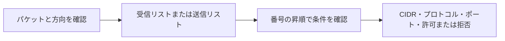

# NACLの方向別ルールとプロトコル指定

## 到達目標

NACLの受信/送信を分けて確認し、番号順とプロトコル・ポートの設定範囲を正しく読む。既存の第3章教材を、IPv4のルールレビューへ具体化する。

## 仕組み

NACL（ネットワークACL）は、関連サブネットを出入りするパケットを制御する。受信の番号付きルール群と送信の番号付きルール群が独立している。入るパケットなら受信リスト、出るパケットなら送信リストを、番号の小さい順で評価する。APIのEgress=trueはサブネットを出る方向の指定で、優先度を表す値ではない。

ルールにはCIDR、プロトコル、TCP/UDPのポート範囲、許可/拒否、ルール番号を指定する。番号を100・110のように空けておけば間へ追加しやすい。番号の大きさは性能や安全性の点数ではない。

Protocol=-1は全プロトコル。PortRangeに443だけを書いても、この指定ではポート範囲で限定されず全ポートを対象とする。TCP 443だけを対象にするにはProtocol=6（TCP）とPortRange=443〜443、適切な方向とCIDRを指定する。UDPなら17を使う。同じ443という番号だけでTCP/UDPを同一視しない。

## 比較・条件

| 確認箇所 | 意味 | 混同しないこと |
| --- | --- | --- |
| Egress | 出る方向かどうか | 受信/送信の番号を混ぜない |
| RuleNumber | その方向の評価順 | 追加日時や降順で読まない |
| Protocol=6とPortRange | TCPと必要なポート範囲 | 全プロトコルの-1とは違う |
| RuleAction | 条件に一致するパケットの許可/拒否 | 経路作成やアプリ認可ではない |

SGは相手SGを使った通信許可も扱えるが、ここで確認するNACLルールはCIDRと方向などを持ち、サブネット境界で確認する。SGの許可があるという理由だけで、NACLの方向別設定を省略してよいとは判断しない。

## 限界

本単位では複数の競合一致ルールの最初一致判定を網羅した確認とはしない。昇順という事実だけから、どの許可/拒否が最終的に適用されるかを教材の確認済み範囲へ広げない。ステートレスな戻り通信とクライアントのエフェメラルポート、IPv6/ICMP、デフォルトACLとカスタムACLの違いは別途現行公式文書を確保して扱う。

NACL設定だけで有効な経路やサービスの待受・認証が用意されるわけではない。正解を決めるときは、設定の対象範囲とネットワーク全体の到達性を区別する。

## ケース問題

正本は `knowledge/game-cases.json` の `nacl-direction-protocol`。受信/送信を混ぜない評価順と、Protocol=-1による広い許可を見抜く独立2問。

- 送信番号50を受信へ混ぜる誤答：方向別の独立リストを無視している。
- 200から100へ読む誤答：番号は昇順。
- -1でも443だけになるという誤答：全プロトコル指定ではポート範囲で限定されない。
- 別方向の番号を変える誤答：その受信ルールのプロトコル条件は変わらない。

## 用語・補足

**ACL**はアクセス制御リスト。**CIDR**は対象のIP範囲を表す記法。**RuleAction**は許可/拒否の指定。**Protocol**はTCP/UDPなどの通信形式を指定する番号。**PortRange**はそのプロトコルのポート範囲。これらをまとめて読むことで、見た目の443だけから許可範囲を誤解するのを防ぐ。

## 根拠と確認状態

2026-10-06に原稿作成後の内容確認を実施。同一担当確認、独立監査・実AWS実験・本人理解評価は未実施。ゲーム取り込みと公開は別管理。AWS公式リポジトリの固定コミットを無料で閲覧。

- [api_op_CreateNetworkAclEntry.go](https://github.com/aws/aws-sdk-go-v2/blob/2ba0e39015ddf9c91c6c378f8a4fb79dcb4353da/service/ec2/api_op_CreateNetworkAclEntry.go) — NACLの受信と送信は独立した番号付きルール。番号の昇順に評価し、関連サブネット境界のパケットを許可/拒否する。Egressは送信方向の指定。Protocol=-1は全プロトコルでポート指定に関係なく全ポートを対象とする。TCPは6、UDPは17。
- [types.go](https://github.com/aws/aws-sdk-go-v2/blob/2ba0e39015ddf9c91c6c378f8a4fb79dcb4353da/service/ec2/types/types.go) — NetworkAclEntryは方向・IPv4/IPv6 CIDR・プロトコル・TCP/UDPポート範囲・許可/拒否・番号を持つ。
