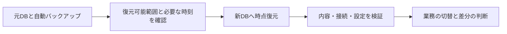

# RDSの時点復元：時刻と新しいDBを確認する

既存素材ID `point-in-time-recovery` を初めて詳細単位にする。元レッスンはch06-l03、元の単問q089は保持し、同じ問題を追加コピーせず、時刻指定と復元先設定まで掘り下げる。RDS for PostgreSQLのDBインスタンス、通常のリージョン構成が対象。Aurora、RDS Custom、DBクラスター復元は範囲外。

## 仕組み

RDS（Amazon Relational Database Service）はDBを管理するサービス。PITR（Point-in-Time Recovery、時点復元）は、自動バックアップの保持範囲内で指定した時刻の内容から新しいDBインスタンスを作る操作。現在の元DBをその場で巻き戻すものではない。`TargetDBInstanceIdentifier` は作成する新DBの名前であり、元DBの置換指示ではない。

CreateDBInstanceの `BackupRetentionPeriod` は自動バックアップ保持日数。正の値で有効、0で無効にするが、リードレプリカのソース等には0にできない条件がある。Auroraでは保持はクラスターで管理する。値の存在だけで復元可能と判断せず、実際に復元可能な範囲を確認する。

RestoreDBInstanceToPointInTimeの `RestoreTime` はUTCで、LatestRestorableTimeより前の時刻を指定する。保持期間外の時刻には使えない。`UseLatestRestorableTime` を使う場合、明示したRestoreTimeと同時に指定しない。最新が誤更新後なら、「最新だから正しい」とは判断しない。

## 適用条件と限界

誤更新時刻と、戻したい正しい状態を特定する。元DBの最新復元可能時刻、保持範囲、作成先の容量・設定・アクセスを確認する。復元後は指定時点より後の正しい更新も含まれないので、必要な差分や業務の整合を別に扱う。データが復元されたことを、全業務が復旧したことと同じ扱いにしない。

復元先は元の多くの設定を持つが、何も指定しなければ配置AZやセキュリティグループ、DBサブネットグループ、DBパラメーターグループ等に既定・システム選択が適用される。この対象では既定の配置はSingle-AZ。元がカスタム設定なら必要な値を指定・確認し、元と完全に同じだと決めつけない。PostgreSQL以外には条件の差があるため全エンジンへ一般化しない。

復元の受付と利用可能な完了を区別し、接続先、データ内容、アプリからの読取り・書込み、必要なアクセスと切替手順を検証する。自動で元アプリの接続先が切り替わるとは説明しない。復旧時間の実測、料金・保持の全設計、実AWS実験は未実施。

## 比較・条件

| 判断 | 適する状況 | 不適合な条件 |
|---|---|---|
| RestoreTimeを指定 | 誤更新前の具体的な時刻へ戻す | 保持範囲外、LatestRestorableTime以降、UTC誤認 |
| 最新復元可能時刻を使う | 業務が最新の復元可能状態を求める | 最新の状態に誤更新が既に含まれる |
| 新DBの設定と内容を点検 | 元と異なる既定設定や接続先を調整する | 元DBが自動巻戻し済みとして確認を省略する |
| 別のバックアップを調べる | 必要時点が自動バックアップの復元範囲外 | 保持日数を今から伸ばせば過去の消えた範囲が戻るという期待 |

## ケースと誤答理由

正本 `game-cases.json` の `rds-photo-pitr`。写真の注文DBを10:00 UTCに誤更新した架空の状況で、既知の復元可能範囲内の09:59 UTCを指定する判断を問う。第2問は別DBとして復元した後の接続・設定確認で、第1問に依存しない。全選択肢の理由を保持する。転移問いでは必要時点が範囲外となり、別の有効なバックアップの確認へ判断を変える。

## 分類とゲーム

`concept-point-in-time-recovery-target` は時点と復元先の概念、`case-rds-photo-pitr` は連続2問。ch06・ch11へ共有する。既存155素材の同じIDを詳細化し、カード候補を言い換えて増やさない。新カード効果は未設計。大きな復旧システム・ビルドの設計と実験は別作業。

## 出典と確認

無料公開のAWS公式SDK、コミット `2ba0e39015ddf9c91c6c378f8a4fb79dcb4353da`。2026-10-06、Codexが作成後にUTC・範囲・新DB・既定設定・全誤答を別工程で照合。同一担当で、別担当者の独立監査・AWS実験・本人理解評価は未実施。

- [RestoreDBInstanceToPointInTime](https://github.com/aws/aws-sdk-go-v2/blob/2ba0e39015ddf9c91c6c378f8a4fb79dcb4353da/service/rds/api_op_RestoreDBInstanceToPointInTime.go)：保持範囲、LatestRestorableTimeより前、UTC、時刻パラメーターの排他、新DBと既定設定、Auroraは別API。
- [CreateDBInstance](https://github.com/aws/aws-sdk-go-v2/blob/2ba0e39015ddf9c91c6c378f8a4fb79dcb4353da/service/rds/api_op_CreateDBInstance.go)：保持日数の正値/0と0にできない条件、Auroraの別管理。

AWSドキュメントサイトは取得制約あり。現行公式SDKで確認した範囲に限定し、元の第6章全体を内容確認済みや公開済みに変えない。
