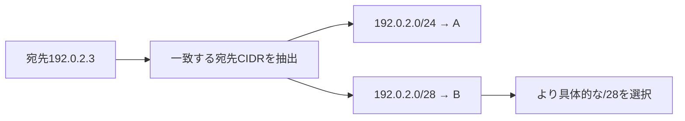

# ルートの最長プレフィックス一致

## 到達目標

複数の宛先CIDRに一致するIPv4ルートから、より具体的な一致を選ぶ。第3章の既存route素材を詳述し、SG/NACLによる許可とは分けて判断する。

## 仕組み

ルートは宛先のネットワーク範囲と送り先のターゲットを持つ。宛先IPに複数のルートが一致する場合、最も具体的な一致を選ぶ。CIDRの末尾の数字はプレフィックス長で、同じIP系列では数字が大きいほど狭い範囲となる。「狭いルートなら常に使う」ではなく、まず宛先がその範囲に含まれる必要がある。

192.0.2.0/24は192.0.2.0〜192.0.2.255、192.0.2.0/28は192.0.2.0〜192.0.2.15。宛先192.0.2.3は両方に含まれるので/28のルートを選ぶ。宛先192.0.2.20は/28に含まれないため、/24が候補になる。例のアドレスとA/B/Cは教材用の仮定。

## 比較・条件

| 判断 | 確認する条件 | 誤った読み替え |
| --- | --- | --- |
| 最長プレフィックス一致 | 宛先が範囲に含まれ、候補より具体的か | 数字が大きければ宛先が違っても選ぶ |
| デフォルトルート/0 | より具体的な一致があるか | /0が常に最優先 |
| SG/NACL | 相手・方向・プロトコル等の許可 | ルートが許可ルールを自動で作る |

ルートを削除すると現在残る一致から選び直す。/28を削除し/24と/0が残る例では、宛先192.0.2.3に対して/24のAが/0のCより具体的。ターゲットの有効性とネットワーク全体の到達性は別途確認する。

## 限界

ここでは異なる宛先CIDRの有効ルートだけを比較する。同じ宛先CIDRの静的/伝播ルートの優先度、IPv6、プレフィックスリストの競合、ターゲットが無効なblackhole時の挙動を、この原則だけで説明し切ったとはしない。無効な具体的ルートがあると自動的に広いルートへ逃げる、と根拠なく考えない。

経路が選ばれても、SG/NACL、OS、待受、認証などが別に必要。経路の選択と通信の成功を混同しない。

## ケース問題

正本は `knowledge/game-cases.json` の `route-longest-prefix`。複数一致の選択と、具体的ルート削除後の選択を独立2問で扱う。

- 広い/24が常に優先という誤答：具体性の原則が逆。
- A/Bへ必ず複製する誤答：宛先選択をファンアウトと混同している。
- 削除済みBを使う誤答：現在の一覧を見ていない。
- /0最優先という誤答：デフォルトより具体的な一致が残っている。

## 用語・補足

**ルートテーブル**は宛先と送り先の対応を持つ表。**ターゲット**は次の送り先のリソース。**最長プレフィックス一致**は、一致する候補のうち最も長いプレフィックス、すなわち具体的な範囲を選ぶこと。**デフォルトルート**は/0のように広い宛先を扱う経路で、アクセス権の付与ではない。

## 根拠と確認状態

2026-10-06に原稿作成後の内容確認を実施。同一担当確認、独立監査・実AWS実験・本人理解評価は未実施。ゲーム取り込みと公開は別管理。AWS公式リポジトリの固定コミットを無料で閲覧。

- [api_op_CreateRoute.go](https://github.com/aws/aws-sdk-go-v2/blob/2ba0e39015ddf9c91c6c378f8a4fb79dcb4353da/service/ec2/api_op_CreateRoute.go) — ルートは宛先CIDRまたはプレフィックスリストとターゲットを指定する。最も具体的な宛先一致を選ぶ。例の192.0.2.3には/24より/28のルートが選ばれる。
- [api_op_AuthorizeSecurityGroupIngress.go](https://github.com/aws/aws-sdk-go-v2/blob/2ba0e39015ddf9c91c6c378f8a4fb79dcb4353da/service/ec2/api_op_AuthorizeSecurityGroupIngress.go) — 受信SGルールは指定した送信元・プロトコル・TCP/UDPポートの通信を許可する。経路のターゲット設定とは別の操作。
