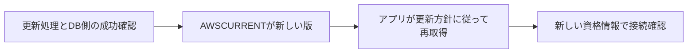

# シークレットの現在版と更新後の再取得

## 到達目標

資格情報の更新後、シークレットの現在版とアプリが使う値を区別して確認する。既存secrets-manager素材を、版と再取得の判断へ具体化する。

## 仕組み

シークレットには複数の版があり、ステージングラベルで役割を示す。GetSecretValueでVersionIdとVersionStageを省略するとAWSCURRENTを取得する。AWSCURRENTを新しい版へ移すと、移動前の版へAWSPREVIOUSが移る。これは版の選択を変える操作で、既に取得しているアプリ内のパスワードを自動で上書きする操作ではない。

起動時に取得した旧値を保持し続けるアプリでは、DB側の更新が成功しても次の新規接続が失敗し得る。キャッシュは速度や費用の点で推奨されるが、更新に合わせた再取得・更新方針を用意し、取得した版と実際の接続を確認する。毎要求で無条件にAPIを呼ぶ方法だけを正解にしない。

## 比較・条件

| 要素 | 担当するもの | 保証しないこと |
| --- | --- | --- |
| AWSCURRENT | 現在版の選択 | アプリ内の既取得値の自動変更 |
| AWSPREVIOUS | 前に現在版だった版 | DB側が今も旧値を受け付ける保証 |
| KMS鍵素材の更新 | 暗号鍵の材料の更新 | DBパスワードの変更 |
| キャッシュの再取得 | アプリが使う値の更新 | DB側の更新成功そのもの |

秘密値の取得にはsecretsmanager:GetSecretValueが必要。顧客管理KMS鍵で保護する場合は、その鍵のkms:Decryptも確認する。片方の権限だけで十分とは考えない。

## 設定テストと非同期更新

RotateSecretは非同期の更新処理を開始する。開始成功を更新完了とみなさない。RotateImmediatelyは既定trueで、省略すると直ちに更新する。falseでは次回ウィンドウを待つ設定となるが、LambdaのtestSecretで設定をテストし、AWSPENDINGのテスト版を作成して除去する。「falseなら何も実行しない」ではない。

既存のAutomaticallyAfterDaysやrate設定を変更してfalseにしても、以前予定された更新が起きる場合がある。新規cron設定の設問と、既存予定の移行を分ける。更新失敗時にはAWSPENDINGが残ることがあり、AWSCURRENTと別版に残ると後続の更新は進行中と判断されてエラーになる。原因確認なしにラベルだけ消して解決済みにしない。

## 限界

ラベルを戻す操作だけで外部DBの資格情報まで戻ったとは判断しない。DB更新・版・アプリの取得を一致させて確認する。4段階関数の実装、単一/交互ユーザー戦略、AWSが管理する更新方式全般は別途公式根拠と検証が必要。本単位はLambda更新関数を使う範囲。

実AWSのDB更新、同時更新、接続プールとキャッシュ製品ごとの更新間隔、完全なIAM/キーポリシー評価は未実験。秘密値をログやソースへ露出させず、障害時の取得と接続の状況を確認する。

## ケース問題

正本は `knowledge/game-cases.json` の `secret-version-refresh`。更新成功後の古いキャッシュと、別シークレットでの即時更新なしの設定テストを独立2問にする。

- メモリ自動更新という誤答：版選択と取得済みの値は別。
- KMS更新でパスワードが変わる誤答：扱う対象が違う。
- falseで無操作という誤答：設定テストは行う。
- falseでも必ず即時本更新という誤答：設定テストと本更新の時期を混同している。

## 用語・補足

**ステージングラベル**は版の役割を示す名前。**キャッシュ**は取得した値を一時的に保持して再利用する仕組み。**testSecret**は更新設定・資格情報をテストする段階。**非同期**は開始応答後も処理が続く性質。ラベルがあるだけで全工程の成功を推定しない。

## 根拠と確認状態

2026-10-06に原稿作成後の内容確認を実施。同一担当確認、独立監査・実AWS実験・本人理解評価は未実施。ゲーム取り込みと公開は別管理。AWS公式リポジトリの固定コミットを無料で閲覧。

- [api_op_GetSecretValue.go](https://github.com/aws/aws-sdk-go-v2/blob/2ba0e39015ddf9c91c6c378f8a4fb79dcb4353da/service/secretsmanager/api_op_GetSecretValue.go) — バージョンID/ステージを省略するとAWSCURRENTを返す。AWSPREVIOUSの取得を指定できる。キャッシュは速度/費用を改善する。顧客管理KMS鍵で保護したシークレットにはGetSecretValueに加えてkms:Decryptが必要。
- [api_op_UpdateSecretVersionStage.go](https://github.com/aws/aws-sdk-go-v2/blob/2ba0e39015ddf9c91c6c378f8a4fb79dcb4353da/service/secretsmanager/api_op_UpdateSecretVersionStage.go) — AWSCURRENTラベルを移すと、移動前のバージョンへAWSPREVIOUSが移る。ラベル操作はシークレットのバージョンを追跡する。
- [api_op_RotateSecret.go](https://github.com/aws/aws-sdk-go-v2/blob/2ba0e39015ddf9c91c6c378f8a4fb79dcb4353da/service/secretsmanager/api_op_RotateSecret.go) — 更新は非同期。RotateImmediately省略時はtrue。falseならLambdaのtestSecretで設定を検証しAWSPENDING版を作成/除去。既存rate/日数設定の予定更新が残る場合がある。AWSPENDINGがAWSCURRENTと異なる版に残ると後続更新は進行中としてエラーになる。
