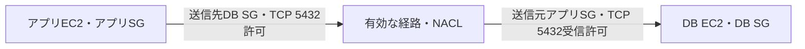

# SG参照と新規接続の許可境界

## 到達目標

同一VPC内の新規TCP接続で、どちら側の何を許可するかを説明する。既存の第3章原稿を詳細化し、接続追跡の全面確認とは区別する。

## 仕組み

SG（セキュリティグループ）の受信ルールは、指定した送信元から対象リソースが通信を受けるための許可。送信ルールは、対象リソースから指定した宛先への通信許可。IPv4/IPv6範囲、プレフィックスリスト、SGなどで相手を指定し、TCP/UDPではポートも指定する。

アプリからDBへ新規接続するなら、アプリ側の送信とDB側の受信を確認する。両方が閉じている前提でDB受信だけを開いても足りない。相手SGを指定すると、そのSGに関連付けられたインスタンスを許可対象にする。同じ表示名のインスタンスを許可する仕組みではない。個々の変更するIPを列挙する代わりに、同一VPCの対象SGで管理できる。

## 比較・条件

| 制御 | 決めるもの | 単独では決まらないもの |
| --- | --- | --- |
| SG受信・送信 | 相手・方向・プロトコル・ポートの許可 | 経路、DBユーザー権限 |
| ルート | 宛先へ送る経路 | SGの許可 |
| NACL | サブネット境界の方向別の許可/拒否 | SGやDB認可 |
| DB認証・認可 | 接続者の識別と操作権限 | ネットワーク経路 |

DB TCP 5432だけが必要なら、任意のIPv4・全ポートに広げるより、アプリSGとの必要な通信に限定する。必要な許可がない原因を特定せず範囲を拡大しない。CDKのconnectionsは構成要素間の開始側送信・受信側受信を補助するが、DBへのログイン権限を与える機能ではない。

## 限界

この確認範囲は同一VPC内の直接接続。SG参照が常に任意のVPCや中継経路で使えるとは主張しない。ルール変更の伝播には小さな遅延があり得る。複数SGの合成、接続追跡と戻り通信、デフォルトSGと新規作成SGの違いは別途公式根拠で確認する。第3章全体を確認済みにはしない。

## ケース問題

正本は `knowledge/game-cases.json` の `sg-app-db-boundary`。第1問は両側を閉じた新規接続、第2問は許可済みでも経路がない状況で、独立して回答できる。

- DB受信だけを開く誤答：閉じた開始側送信が残る。
- 任意IPv4へ拡大する誤答：最小限の条件に合わず、別側の許可も変えない。
- SG参照でルートやDB権限が付く誤答：異なる制御の役割を混同している。

## 用語・補足

**Ingress**は受信、**Egress**は送信。**SG参照**は相手SGを通信の許可対象にする指定。**CIDR**はIP範囲を表す記法。**ポート**は通信先のサービスを区別する番号で、5432はこのケースで設定したDB待受ポート。すべてのDBが5432を使うという意味ではない。

## 根拠と確認状態

2026-10-06に原稿作成後の内容確認を実施。同一担当確認、独立監査・実AWS実験・本人理解評価は未実施。ゲーム取り込みと公開は別管理。AWS公式リポジトリの固定コミットを無料で閲覧。

- [api_op_AuthorizeSecurityGroupIngress.go](https://github.com/aws/aws-sdk-go-v2/blob/2ba0e39015ddf9c91c6c378f8a4fb79dcb4353da/service/ec2/api_op_AuthorizeSecurityGroupIngress.go) — 受信許可は送信元IPv4/IPv6範囲、プレフィックスリスト、SGから一つを指定し、プロトコルとTCP/UDPポートを指定する。関連SGのインスタンスからの受信を許可する。
- [api_op_AuthorizeSecurityGroupEgress.go](https://github.com/aws/aws-sdk-go-v2/blob/2ba0e39015ddf9c91c6c378f8a4fb79dcb4353da/service/ec2/api_op_AuthorizeSecurityGroupEgress.go) — 送信許可は宛先IPv4/IPv6範囲、プレフィックスリスト、宛先SGのインスタンスへの通信を許可する。
- [README.md](https://github.com/aws/aws-cdk/blob/6ede0060d93bab5903a0528bdd323a56e1430003/packages/aws-cdk-lib/aws-ec2/README.md) — 異なる構成要素間の通信には、開始側SGのEgressと受信側SGのIngressを設定する。connectionsが両側のSG設定を補助する。
- [api_op_CreateRoute.go](https://github.com/aws/aws-sdk-go-v2/blob/2ba0e39015ddf9c91c6c378f8a4fb79dcb4353da/service/ec2/api_op_CreateRoute.go) — ルートは宛先CIDR/プレフィックスリストとターゲットを指定し、最も具体的な宛先一致で経路を選ぶ。
- [api_op_CreateNetworkAclEntry.go](https://github.com/aws/aws-sdk-go-v2/blob/2ba0e39015ddf9c91c6c378f8a4fb79dcb4353da/service/ec2/api_op_CreateNetworkAclEntry.go) — NACLには独立した受信/送信の番号付きルールがあり、関連サブネットを出入りするパケットを制御する。
