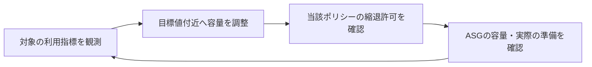

# ターゲット追跡の目標指標と縮退の範囲

## 到達目標

目標指標と希望台数、縮退禁止の対象を分けて判断する。既存第4章のtarget-tracking素材を、構成条件へ適用できる形に詳述する。

## 仕組み

ターゲット追跡は指標を指定した目標値付近へ保つよう容量を増減する方針。平均CPUを50%付近へ保つ例の50はCPU使用率であり、希望台数50ではない。目標値の単位は指標によって違う。目標値は継続的な制御の目安で、瞬時に一致する保証ではない。

TargetTrackingConfigurationは既定の指標かカスタム指標を指定し、TargetValueで目標値を与える。DisableScaleIn=trueにすると、そのターゲット追跡ポリシーはインスタンスを削除しない。既定falseなら縮退も可能。これはそのポリシーの設定であり、手動変更・別ポリシー・障害時の終了まで禁止する設定ではない。

既定指標のASGAverageCPUUtilizationはグループの平均CPU使用率。ALBRequestCountPerTargetはASGのターゲット当たり平均ALBリクエスト数。後者のResourceLabelは対象ALBとターゲットグループを識別し、そのターゲットグループがASGへ関連付いていることが必要。CPUの目標値だけを変更しても、リクエスト指標の対象設定にならない。

## 比較・条件

| 設定 | 判断する内容 | 代替しないもの |
| --- | --- | --- |
| TargetValue | 指標の目標値 | 希望台数・正確な増減台数 |
| DisableScaleIn | 当該ポリシーが縮退できるか | すべての終了・別経路の容量変更の禁止 |
| ALBのResourceLabel | 平均リクエスト数を取る対象 | ターゲットグループのASGへの関連付け |
| DefaultInstanceWarmup | 初期化中の使用量データの扱い | アプリが必ず準備完了する時刻 |
| HealthCheckGracePeriod | 起動直後のヘルス失敗に対する猶予 | ウォームアップの指標集約制御 |

DefaultInstanceWarmupはInServiceへ入った後、初期化と資源使用が安定するまでの時間を考慮する。新インスタンスの使用量データを既存インスタンスと集約する前にウォームアップを待つ。起動直後の使用量を通常時の値と混同しないための設定で、準備を自動的に速くする機能ではない。ヘルスチェック猶予は不健全判定のタイミングを扱い、同じ秒数を設定しても同じ役割にはならない。

## 限界・適用条件

縮退を禁止したままではこのポリシーによる台数削減を期待できない。費用と縮退時の処理保護を要件に合わせる。設定値だけでCPUが常に目標に一致する、無停止になる、何台増える、何秒後に減るとは断定しない。複数ポリシー・欠測・ゼロ容量・高解像度指標・すべてのカスタム指標の適格性と式、ヘルス連携の詳細は別途確認する。実AWSの負荷/権限実験は未実施。

## ケース問題・誤答理由

正本は `knowledge/game-cases.json` の `target-tracking-policy-scope`。第1問は当該ポリシーの縮退禁止だけ、第2問はALB指標の対象関連付け。低CPUなら必ず1台減るという誤答は縮退禁止と台数計算の条件を無視する。全終了禁止という誤答は設定の範囲を広げすぎる。無関係なグループやCPU目標値変更は、リクエスト数の対象設定ではない。

## 用語・補足

**指標（メトリクス）**は使用率などを時間ごとに観測する値。**TargetValue**はその目標値。**ResourceLabel**はALBとターゲットグループから対象を識別する値。**ウォームアップ**は起動後に指標の扱いを安定させるために考慮する期間。**ヘルスチェック猶予**は起動直後の不健全判定を調整する期間。

## 根拠と確認状態

2026-10-07に原稿作成後の内容確認を実施。同一担当確認、独立監査・実AWS実験・本人理解評価は未実施。ゲーム取り込みと公開は別管理。AWS公式リポジトリの固定コミットを無料で閲覧。

- [README.md](https://github.com/aws/aws-cdk/blob/6ede0060d93bab5903a0528bdd323a56e1430003/packages/aws-cdk-lib/aws-autoscaling/README.md) — Target Tracking Scalingは指標を目標付近へ保つよう増減する。平均CPU50%の例は希望台数50ではない。Default Instance Warmingは使用量データを集約指標へ含める前の初期化期間を考慮する。
- [types.go](https://github.com/aws/aws-sdk-go-v2/blob/2ba0e39015ddf9c91c6c378f8a4fb79dcb4353da/service/autoscaling/types/types.go) — TargetTrackingConfiguration.TargetValueは指標の目標値。DisableScaleIn=trueならそのターゲット追跡ポリシーはインスタンスを削除しない。既定false。ALBRequestCountPerTargetのResourceLabelはASGへ関連付けたターゲットグループを識別する。
- [api_op_UpdateAutoScalingGroup.go](https://github.com/aws/aws-sdk-go-v2/blob/2ba0e39015ddf9c91c6c378f8a4fb79dcb4353da/service/autoscaling/api_op_UpdateAutoScalingGroup.go) — DefaultInstanceWarmupはInService後に初期化と資源使用が安定するまでの秒数。新インスタンスの指標を既存と集約するまで待つ。HealthCheckGracePeriodはヘルスチェック失敗でunhealthyにする前の猶予で、役割が違う。
