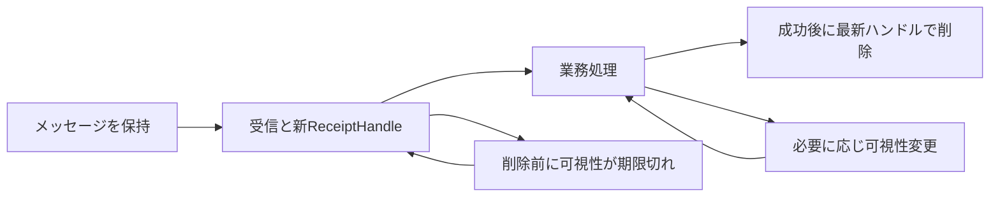

# SQS：可視性の延長と削除する受信を区別する

既存素材ID `visibility-timeout` の詳細単位。第9章ch09-l01の説明と処理時間90秒の既存問題を保持し、延長の起点・ReceiptHandleの変化を追加する。Standardキュー、単一メッセージが対象。FIFO全仕様、DLQ、保持期限・in-flight上限の定量設計は別範囲。

## 仕組み

SQS（Amazon Simple Queue Service）は処理待ちメッセージを保持するキュー。ReceiveMessageで受け取ると、可視性タイムアウトの間ほかの受信者から一時的に見えなくなる。受信は削除ではなく、成功処理後にDeleteMessageで削除する。期限までに削除・延長しなければ再び受信可能になる。

可視性は業務処理を排他的に一度だけ実行する保証ではない。Standardキューでは削除後にも同じメッセージを受信する場合があるため、アプリが冪等（同じ要求を繰り返しても業務結果を重複させない性質）になる設計を確認する。受信・業務完了・削除完了を同じ状態として扱わない。

## 延長の起点

ChangeMessageVisibilityは特定の受信メッセージの可視性を変更する。指定した秒数はその変更要求の時刻から数える。例えば架空の時計で、0秒に受信、20秒で60秒の変更が成功したなら、変更による期限は80秒である。受信時刻から60秒、またはもとの期限に60秒を足す計算とは違う。

この変更値は、そのメッセージの次回の受信に引き継ぐ設定として保存されない。次回受信では本来のタイムアウトへ戻る。キューの既定変更と受信1件への変更を区別する。また残る最大時間を超える要求はエラーになり、自動的に許される最大値へ調整されない。ここでは12時間上限付近の設計を扱わず、成功した短い変更の条件を明示する。

## 削除の識別子

MessageIdはメッセージの識別子、ReceiptHandleは受信に伴うハンドル。同じメッセージを再受信するとReceiptHandleは新しい値になる。DeleteMessageでは送信・メッセージのMessageIdではなく、最新の受信で得たReceiptHandleを使う。古いハンドルだと成功応答でも削除されない場合がある。

## 比較・条件

| 調整・操作 | 働く範囲 | 限界・代償 |
|---|---|---|
| 可視性を処理時間に合わせる | 完了前の再可視化を減らす | 長すぎると処理者が失敗した後の再処理が遅れる |
| ChangeMessageVisibility | 現在受信した特定メッセージの期間を変更 | 次回受信へ同じ値を固定しない、変更時刻から数える |
| 成功後に最新ReceiptHandleで削除 | 処理済みメッセージを削除する要求 | 業務完了前の削除では、後の失敗に作業を残せない |
| メッセージ保持期限を変える | キュー内に残す寿命を変える | 受信後の不可視期間の代わりではない |
| 冪等処理 | 再受信による副作用の重複を避ける | タイムアウト設定だけでは業務上の重複を除去しない |

具体的な冪等性の実装、DBへの確定とメッセージ削除の間の障害、DLQへ隔離された後の再投入は別単位で検討する。ワーカーを増やすだけでこの境界が消えると考えない。

## ケースと誤答理由

正本 `game-cases.json` の `sqs-visibility-receipt`。架空の時計の延長期限と、MessageIdが同じでも再受信で変わるReceiptHandleを問う。各問は独立した条件を持ち、全選択肢の計算・識別子の誤りを説明する。転移問いでは変更後にワーカーが失敗し、長い不可視期間が再処理の遅れになるという代償へ判断を移す。

## 分類とゲーム

`concept-visibility-timeout-receipt` は期間と受信の概念、`case-sqs-visibility-receipt` は連続2問。ch08・ch09・ch11へ同じ素材を共有する。既存155素材の詳細化で、新しい言い換え候補を増やさない。新カード効果は未設計。ゲームのターン数をAWSの秒数保証にしない。

## 出典と確認

無料公開のAWS公式SDK、コミット `2ba0e39015ddf9c91c6c378f8a4fb79dcb4353da`。2026-10-06、Codexが作成後に時計の計算、ハンドル、次回受信の条件、全誤答を別工程で照合。同一担当で、別担当者の独立監査・AWS実験・本人理解評価は未実施。

- [ReceiveMessage](https://github.com/aws/aws-sdk-go-v2/blob/2ba0e39015ddf9c91c6c378f8a4fb79dcb4353da/service/sqs/api_op_ReceiveMessage.go)：一時不可視と期限後の再受信、短すぎる/長すぎる代償。
- [ChangeMessageVisibility](https://github.com/aws/aws-sdk-go-v2/blob/2ba0e39015ddf9c91c6c378f8a4fb79dcb4353da/service/sqs/api_op_ChangeMessageVisibility.go)：変更時刻から数える例、上限超過、次回受信へ引継がない条件。
- [DeleteMessage](https://github.com/aws/aws-sdk-go-v2/blob/2ba0e39015ddf9c91c6c378f8a4fb79dcb4353da/service/sqs/api_op_DeleteMessage.go)：最新ReceiptHandle、古い値の限界、Standard削除後の再受信と冪等性。

AWSドキュメントサイトは取得制約あり。元の第9章全体や公開状態へ確認を波及させない。
